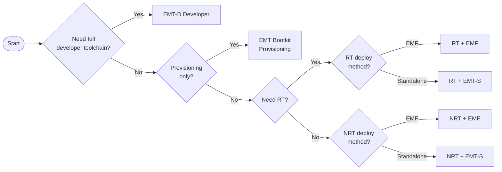

# Edge Microvisor Toolkit

The Edge Microvisor Toolkit is a streamlined container host that
showcases the Intel silicon optimizations. Built on Azure Linux, it features a
Linux Kernel maintained by Intel, incorporating all the latest kernel and user
patches.

It is published in several versions, both immutable and mutable. Use them to
quickly deploy and run your solutions for multiple scenarios, like benchmarking
and validation of edge AI computing workloads, including real-time processing,
or build your own system, using the existing infrastructure.

We are excited to announce the EMT "Next" `v6.19` kernel currently which will converge
to the next LTS kernel for EMT by 2026.1 (mid-2026) release. The stable `v6.12` kernel
continues to be maintained and recommended for most users unless you have newer Intel
platforms that requires an earlier move ot hte "Next" kernel.

| Intel Platform | Recommended EMT   | Remarks  |
| -------------- | ------------------| -------  |
| ARL-U/H        | EMT Stable        | Supported|
| ARL-S          | EMT Stable        | Supported|
| ASL            | EMT Stable        | Supported|
| TWL            | EMT Stable        | Supported|
| MTL-U/H        | EMT Stable        | Supported|
| MTL-PS         | EMT Stable        | Supported|
| BTL-S hybrid   | EMT Stable        | Supported|
| BTL-S 12P      | EMT Stable        | Supported|
| PTL            | EMT Next          | Preview  |
| WCL            | EMT Next          | Not yet supported|
| NVL            | EMT Next          | Not yet supported|

## Selecting EMT Edition

The table below summarizes the released versions:

| Edition | Description | Stable Kernel | Next Kernel | Docs |
|--------|-------------|---------------|-------------|------|
| **Standalone (Immutable)** | Minimal runtime; immutable rootfs | ✓ | ✓ | [Standalone Node](https://github.com/open-edge-platform/edge-microvisor-toolkit-standalone-node) |
| **Developer Node (Mutable)** | Full toolchain, optional RT | ✓ | ✓ | [Developer Node](./docs/developer-guide/emt-architecture-overview.md#developer-node-mutable-iso-image) |
| **EMT for EMF** | EMF-integrated orchestrated deployments | ✓ | ✓ | [EMT + EMF](./docs/developer-guide/emt-deployment-edge-orchestrator.md) |
| **Bootkit** | Minimal iPXE provisioning image | ✓ | – | [Bootkit](./docs/developer-guide/emt-bootkit.md) |

The Edge Microvisor Toolkit has undergone extensive validation across all Intel
platforms such as  Xeon®, Intel® Core Ultra™, Intel Core™ and Intel® Atom®. It
provides robust support for integrated NPU, as well as a
[selection of discrete GPU cards](./docs/developer-guide/emt-system-requirements.md#hardware-requirements).

You can either build the Edge Microvisor Toolkit by following step-by-step
instructions or download it directly. Both the Build system and the Edge Microvisor
Toolkit are available as Open-Source.

## Get Started

All articles required to quickly learn how to work with Edge Microvisor Toolkit can be found [here](./docs/developer-guide/emt-get-started.md).

**Demos**
* [Standalone Edge Microvisor Toolkit (EMT-S) integration with Edge Microvisor Bootkit](https://www.youtube.com/watch?v=rmgmWYi6OpE):
  This demo includes the USB Device Preparation, Provisioning Process, System Readiness, and Final Boot with the cluster starting successfully.
* [Edge Microvisor Toolkit Standalone Node 3.0](https://www.youtube.com/watch?v=j_4EX_wggSI):
  This demo provides a brief walkthrough of Edge Microvisor Toolkit Standalone Node for the 3.0 release, covering various use cases.

**Demos**
* [Standalone Edge Microvisor Toolkit (EMT-S) integration with EMT-Micro OS](https://www.youtube.com/watch?v=rmgmWYi6OpE):
  This demo includes: USB Device Preparation, Provisioning Process, System Readiness, and Final Boot with the cluster starting successfully.

The OS Image Composer is a *new* project in the Open Edge platform family that allows
you to compose custom OS images from popular distributions using pre-built
artifacts. You can check out that repository [here](http://github.com/open-edge-platform/os-image-composer)

## Getting Help

If you encounter bugs, have feature requests, or need assistance,
[file a GitHub Issue](https://github.com/open-edge-platform/edge-microvisor-toolkit/issues).

Before submitting a new report, check the existing issues to see if a similar one has not
been filed already. If no matching issue is found, feel free to file the issue as described
in the [contribution guide](./docs/developer-guide/emt-contribution.md).

For security-related concerns, please refer to [security considerations](./docs/developer-guide/emt-security-considerations.md).

[Azure Linux Documentation](toolkit/docs/), may also be useful, if you encounter
problems when using Edge Microvisor Toolkit. Its copy is part of the Edge
Microvisor Toolkit repository, for easier access.

## Contributing

As an open-source project, Edge Microvisor Toolkit always looks for community-driven
improvements. If you are interested in making the product even better, see how you can
help in the [contribution guide](./docs/developer-guide/emt-contribution.md).

## License Information

Edge Microvisor Toolkit is based on [Azure Linux](https://github.com/microsoft/azurelinux),
sharing its permissive open-source license:
[MIT](https://github.com/microsoft/azurelinux/blob/3.0/LICENSE).

For more details, see the [LICENSE](./LICENSE) document.

### Attribution

We acknowledge Microsoft's contributions to the open-source community and thank
them for providing the secure and efficient Linux distribution.
