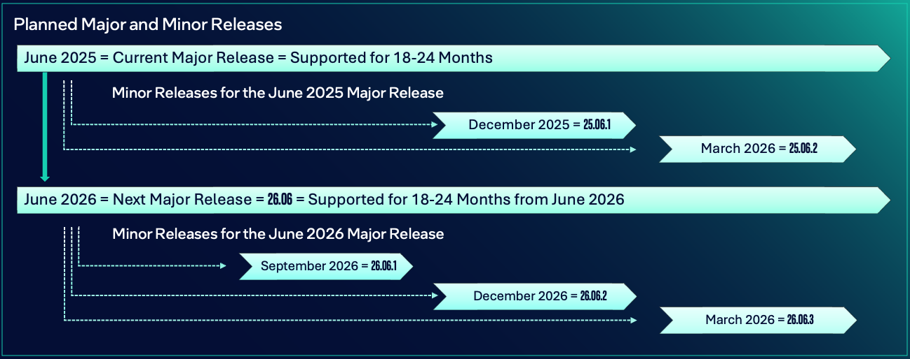
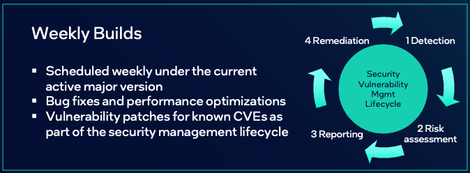

# Releases and their Support

The releases of Edge Microvisor Toolkit take three forms: major, minor, and weekly.

## Major Releases

A major release of Edge Microvisor Toolkit typically occurs once a year in June. New feature development takes place on the latest major release and its subsequent minor releases. Every major release is supported for 18 to 24 months.
The minor releases are part of the active maintenance window. There are no separate branches created or maintained for either the major release or minor releases during the active maintenance window.

During the 18-24 month active maintenance window for a major release of Edge Microvisor Toolkit, active support follows open-source practices, including the fixing of bugs found by the community. You can [open an issue](https://github.com/open-edge-platform/edge-microvisor-toolkit/issues) or [submit a design proposal or a pull request](./docs/developer-guide/emt-contribution.md).

A major release introduces significant changes to the operating system and its capabilities. These changes may include base operating system updates and a Linux kernel upgrade, which may affect software compatibility. A major release also typically includes new features, bug fixes, and CVE patches.

Beyond the active maintenance window of 18 to 24 months, support will be in the form of a community-driven best effort. After the end of the 18-24 month active maintenance window for a major release, it is recommended that you transition your Edge Microvisor Toolkit deployments to the next major release for continued support.

## Minor Releases

A minor release, which delivers incremental updates on top of the current major version, typically occurs three times a year, in March, September, and December. These minor releases are part of the 18-24 month active maintenance window of a major release.
There are no separate branches created or maintained for any minor release during the active maintenance window.

Focused on continuous improvement, these non-breaking minor releases may include package upgrades, new feature enablement, bug fixes, performance optimizations, and security vulnerability patches. Minor releases may also include new packages, such as developer tools and user applications, available through the Edge Microvisor Toolkit RPM repository.

## Weekly Releases

Weekly releases typically include bug fixes, performance optimizations, and vulnerability patches for known CVEs. You can find the latest weekly build in [Discussions](https://github.com/open-edge-platform/edge-microvisor-toolkit/discussions/categories/announcements?discussions_q=is%3Aopen+category%3AAnnouncements).

## No Long-Term Support

No long-term support version is maintained, nor planned. The most recent major version is the recommended stable release.

## Version Numbers

Starting with the minor release planned for December 2025, Edge Microvisor Toolkit will adopt a `YEAR-BASED MAJOR.MONTH.PATCH` format.

As a result, the version number of the minor release planned for December 2025 will be `25.06.1`, with the number for `MONTH` denoting the month in which the minor release's major version was released --- in this case, `06` for June.

The minor release planned for March 2026 will be version number `25.06.2`, and the next major release, planned for June 2026, will advance to the following form: `26.06`.

## Get Support or Contribute on GitHub

To get support for Edge Microvisor Toolkit or contribute to its development, see the following resources:

* [Issues](https://github.com/open-edge-platform/edge-microvisor-toolkit/issues)
* [Discussions](https://github.com/open-edge-platform/edge-microvisor-toolkit/discussions)
* [Contribution Guide](./docs/developer-guide/emt-contribution.md)

