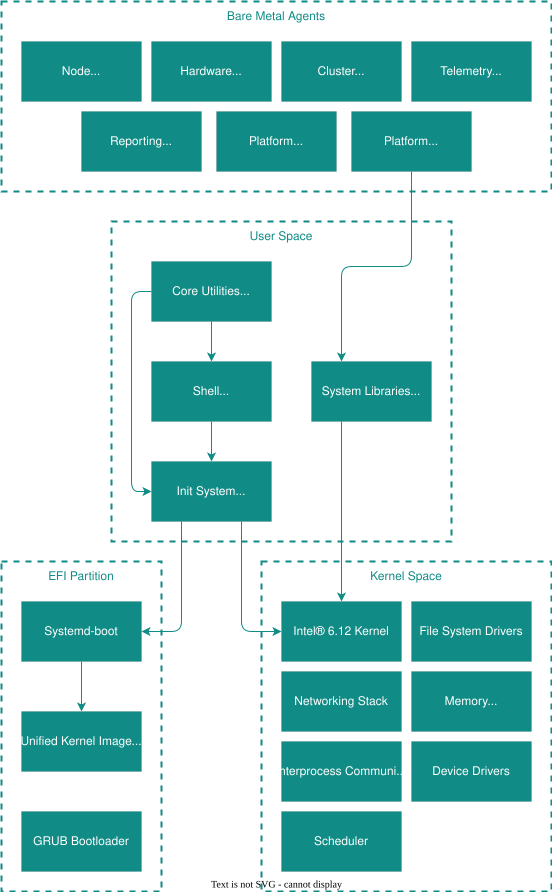

# Architecture Overview

Edge Microvisor Toolkit is an edge-optimized container host enabled with the latest Intel silicon capabilities for Edge AI workloads. Based on Azure Linux, using the RPM Package
Manager system, it can be easily built in a way that fits your custom  needs.

This article provides an overview of the build infrastructure as well as architectural
details of the OS itself.

## Edge Microvisor Toolkit

Edge Microvisor Toolkit is produced and maintained in
[several editions](./get-started/emt-versions.md), in both immutable and
mutable images. It enables you to quickly deploy and validate workloads on Intel®
platforms in order to demonstrate the full capabilities of Intel silicon for various scenarios. There are several options for deploying the toolkit:

- ISO installer with a mutable image using GRUB as the second-stage bootloader.
- ISO installer with an immutable image using systemd-boot as the second-stage bootloader with Kubernetes.
- RAW and VHD/X: immutable image using systemd-boot as the second-stage bootloader.
- RAW and VHD/X: immutable image using systemd-boot as the second-stage bootloader, with the Preempt_RT kernel patches to support real-time computing.

The two immutable image versions integrate the Intel® kernel and
enable the software and features offered by
[Edge Manageability Framework](https://github.com/open-edge-platform/edge-manageability-framework).
Here's an overview of key software components:



## Edge Microvisor Toolkit Image Versions

The toolkit comes pre-configured to produce different images; the following table outlines the key differences between them.

|  Feature         | Edge Microvisor Toolkit Developer Node | Edge Microvisor Toolkit Standalone Node & Orchestrated                                   |
| -----------------| -------------------- | ------------------------------------------------- |
| Capabilities | <ul><li>Easy to install, bootable ISO image with precompiled packages for developer evaluation.</li> <li> Includes installable rpms with TDNF for extending baseline functionality.</li> <li>Complete with a toolkit to build an image with opt-in data integrity and security features.</li></ul> | <ul><li>Designed for [Edge Manageability Framework](https://github.com/open-edge-platform/edge-manageability-framework) and can be used to onboard and provision edge nodes at scale.</li><li>Can be used independently on bare metal or as a guest OS.</li><li>Fast atomic updates and rollback support with a small image footprint and short boot time.|
| Image Type       | Mutable ISO          | Immutable RAW + VHD                               |
| Update Mechanism | RPM package updates with TDNF | Image based A/B updates + Rollback       |
| Linux Kernel     | Intel® Kernel 6.12   | Intel® Kernel 6.12                                |
| Real time        | Available for opt-in | Image variants with standard and RT kernel provided |
| Desktop Virtualization | Available      | Dedicated non-RT image variant provided                                    |
| Add-on packages  | Available for opt-in: Docker + K3s | Downloaded during installation: K3s and extensions    |
| OS Bootloader    | GRUB                 | systemd-boot                                      |
| Secure Boot      | Available for opt-in | Enabled                                           |
| Full Disc Encryption | Available for opt-in | Enabled                                       |
| dm-verity        | Available for opt-in | Enabled                                           |
| SELinux          | Permissive           | Permissive                                        |

### Developer Node mutable ISO image

The mutable developer node in an ISO format allows you to add packages and
[customize the system after deployment](./emt-tutorials.md).
During setup you can select one of four versions:

- Standard kernel
- Standard kernel with Docker and K3s provisioned during installation
- [Kernel with real-time extensions](#preempt-rt-kernel)
- [Kernel with real-time extensions](#preempt-rt-kernel) and Docker and K3s provisioned during installation

As a customizable developer version that includes only essential pre-installed
packages, it provides a basic ready-to-use environment:

| Item              | Details                                         |
| ------------------| ----------------------------------------------- |
| Packages          | approximately ~400                              |
| Core system tools | bash, coreutils, util-linux, tar, gzip          |
| Networking        | curl, wget, iproute2, iptables, openssh         |
| Package Management | tdnf, rpm                                      |
| Development       | gcc, make, python3, perl, cmake, git            |
| Security          | openssl, gnupg, selinux, cryptsetup, tpm2-tools |
| Filesystem        | e2fsprogs, mount                                |
| Included in kernel | iGPU, dGPU (Intel® Arc&trade;), SR-IOV, WiFi, Ethernet, Bluetooth, GPIO, UART, I2C, CAN, USB, PCIe, PWM, SATA, NVMe, MMC/SD, TPM, Manageability Engine, Power Management, Watchdog, RAS |

You can install additional RPM packages, using DNF to tailor the operating system to your needs.
The supported package repository enables you to tailor the image with a container runtime, orchestration software,
monitoring tools, cloud-native software, and other edge software.

If quick responses to critical events are crucial for
your use case, you can use the [kernel with real-time extensions](#preempt-rt-kernel).

> **Note:** You can learn more about specific kernel patches and the features they address in the relevant
> [SPEC file](https://github.com/open-edge-platform/edge-microvisor-toolkit/blob/3.0/SPECS/kernel/kernel.spec)

### Standalone Node immutable RAW images

The Standalone Node is an immutable, ready-made solution for deploying and validating Edge AI applications. It uses Secure
Boot technology to protect against injecting malicious software, both at rest and during
runtime. This image cannot be modified after deployment.

You can download the Edge Microvisor Toolkit Standalone Node installer to your device, run it to
create a bootable USB stick, and use the USB stick to install the Standalone Node.

#### Standard kernel with integrated Docker and K3s

This image has integrated Docker and K3s for deploying and managing applications.
See the [K3s extensions](./architecture/emt-extensions-and-patches.md#extensions) section for more details.

#### Kernel with real-time extensions and integrated Docker and K3s

This image has integrated Docker and K3s for deploying and managing applications. The image
uses [kernel with real-time extensions](#preempt-rt-kernel) to enhance real-time
performance. Use this image if quick responses to critical
events are crucial for your use case.

#### Desktop Virtualization - standard Kernel without real-time extensions

Intel® ready-made solution for using Edge Microvisor Toolkit as a host for Windows 10 or
Ubuntu guest virtual machines. This image includes Kubevirt and Intel IDV (Intelligent
Desktop Virtualization) services for launching the virtual machines with SR-IOV capabilities.
This image uses the standard linux kernel.

> **Note:** You can learn more about specific kernel patches related to Kubevirt and Intel IDV
> in the relevant [SPEC file](https://github.com/open-edge-platform/edge-microvisor-toolkit/blob/3.0/SPECS/kernel/kernel.spec)

## Edge Microvisor Toolkit Real Time

To support workloads that have real-time requirements, a dedicated image is generated.
The RT version of Edge Microvisor Toolkit includes several features over the standard release.

### Preempt RT Kernel

The Preempt RT Linux Kernel 6.12 is designed to offer enhanced real-time performance compared
to the standard kernel:

- **Reduced Latency**
The real-time (RT) patch transforms parts of the kernel to be fully preemptible. This means
that high-priority tasks can interrupt lower-priority tasks quickly, leading to significantly
lower worst-case latencies.

- **Deterministic Scheduling**
By threading interrupt handlers and converting spinlocks to preemptible mutexes, the RT
kernel provides more predictable and deterministic behavior. This is crucial for
time-sensitive applications where meeting strict deadlines is mandatory.

- **Improved Interrupt Handling**
In the RT kernel, most interrupts are handled by kernel threads. This allows the scheduler to
manage them more effectively, ensuring that critical real-time tasks are not unduly delayed
by interrupt processing.

- **Better Synchronization Primitives**
The patch refines locking mechanisms, reducing the time when critical sections cannot be
interrupted. This improves the overall responsiveness and guarantees that the system can
handle real-time workloads with minimal jitter.

> **Note:** You can learn more about preempt Kernel and its features at the
> [Linux Intel LTS Kernel Github](https://github.com/intel/linux-intel-lts/blob/main/README.md).
> You can learn more about specific kernel patches related to preempt RT Kernel in the relevant
> [SPEC file](https://github.com/open-edge-platform/edge-microvisor-toolkit/blob/3.0/SPECS/kernel/kernel.spec).

### perf tool

The Linux `perf` tool is a powerful, integrated performance analysis suite, that taps
directly into the Linux Performance Events subsystem. The tool is mostly known for:

- **Comprehensive Metrics**
`perf` can measure a wide range of performance events, including CPU cycles, instructions,
cache misses, branch mispredictions, and more. This granular data is invaluable for
identifying performance bottlenecks in both kernel and user-space applications.

- **Multiple Modes of Operation**
`perf` provides multiple modes of operation that enable capturing a quick summary of
performance counters over different periods. It provides in-depth reports of overall system
performance, as well as visualization of real-time performance data
(using the `top`command).

### Turbostat

Turbostat is an Intel® tool, invaluable when diagnosing performance issues or optimizing
power consumption on systems with Intel® processors. It leverages hardware performance
counters to display detailed, real-time information for each processor core.
The data includes:

- **Real-Time Monitoring** displays per-core frequency, C-state (idle state) residency,
  and power usage.
- **Detailed Metrics** offer insights into performance states (P-states) and helps identify
  issues with efficiency or power management.
- **Diagnostic Utility** is particularly useful for system tuning and benchmarking. It helps
  understand how modern Intel® CPUs manage power under varying workloads.

### Resource Director Technology

Edge Microvisor Toolkit provides basic support for Intel Resource Director Technology
including, Cache Monitoring Technology (CMT), Memory Bandwidth Monitoring
(MBM), Cache Allocation Technology (CAT), Code and Data Prioritization
(CDP) and Memory Bandwidth Allocation (MBA). These technologies facilitate pinning workloads
and isolating specific CPU cores, assigning them to specified tasks.

> **Note:** You can learn more about specific kernel patches related to Resource Director
> Technology in the relevant [SPEC file](https://github.com/open-edge-platform/edge-microvisor-toolkit/blob/3.0/SPECS/kernel/kernel.spec)

### cpupower

`cpupower` is a general tool for controlling CPU power management on Linux, essential
for system administrators looking to optimize CPU behavior according to workload demands.
It is used to query and set up CPU frequency scaling, managing the trade-offs between
performance and power consumption.

- **Frequency Management** enables you to view current CPU frequencies and adjust settings
  using various governors (like performance, powersave, or on demand).
- **Power Saving Adjustments** helps in tuning system’s energy usage by adjusting parameters
  such as frequency limits and enabling/disabling turbo boost.
- **Dynamic Control** provides commands such as `cpupower frequency-info` (to display current
  frequency information) and `cpupower frequency-set` (to adjust CPU frequency settings).


### Kernel Command Line

The kernel command line for the RT kernel can be customized specifically for customer
workloads. Currently, `idle` is the only configured command-line argument that affects
real-time performance.

To configure kernel command line arguments, add them in the `"ExtraCommandLine"` parameter
inside the imageconfig file, as shown in [edge-image](https://github.com/open-edge-platform/edge-microvisor-toolkit/blob/e22a8f4e72d0edc652f1aacd514d0b5bf5de8b80/toolkit/imageconfigs/edge-image.json#L107).

#### **idle=poll**
Forces the CPU to actively poll for work when idle, rather than entering low-power idle
states. In RT systems, this can reduce latency by ensuring the CPU is always ready to
handle high-priority tasks immediately, at the cost of higher power consumption.

> **Note:**
> It is currently not possible to directly modify the kernel command-line parameters once
> a build has been generated, as it is packaged inside the signed UKI. Modifying the kernel
> command line would invalidate the signature. The mechanism to enable customization of the
> kernel command line will be added in future releases.

#### **isolcpus=\<list>**

Isolates specific CPU cores from the general scheduler, preventing non-RT tasks from
being scheduled on those cores. This ensures that designated cores are available solely
for RT tasks. This way, for example, the workloads can be shifted between efficient
and performance cores. The parameter takes lists as values:

- isolcpus=\<cpu core number>,...,\<cpu core number>

  ```bash
  isolcpus=1,2,3
  ```

- isolcpus=\<cpu core number>-\<cpu core number>

  ```bash
  isolcpus=1-3
  ```

- isolcpus=\<cpu core number>,...,\<cpu core number>-\<cpu number>

  ```bash
  isolcpus=1,4-5
  ```

#### **nohz_full=\<list>**
Enables full tickless (nohz) mode on specified cores, reducing periodic timer interrupts
that could introduce latency on cores dedicated to RT workloads.

#### **rcu_nocbs=\<list>**
Offloads RCU (Read-Copy-Update) callbacks from the specified CPUs, reducing interference
on cores that need to be as responsive as possible.

#### **threadinqs**
Forces interrupts to be handled by dedicated threads rather than in interrupt context,
which can improve the predictability and granularity of scheduling RT tasks.

#### **nosmt**
Disables simultaneous multi-threading (hyperthreading). This can prevent contention between
sibling threads that share the same physical core, leading to more predictable performance.

#### **numa_balancing=0**
Disables automatic NUMA balancing. While NUMA awareness is important, automatic migration
of processes can introduce latency. Disabling it helps maintain predictable memory locality.

#### **intel_idle.max_cstate=0**
Limits deep idle states on Intel® CPUs, reducing wake-up latencies that can adversely
affect RT performance.

## Build Artifacts

Each build of Edge Microvisor Toolkit produces several build artifacts based on
the used image configuration. The artifacts come with associated `sha256` files.

- Unique build ID.
- Manifest containing version, kernel version, size, release details and CVE manifest.
- Software BOM package manifests (included packages, dependencies, and patches).
- Signed Image in `raw.gz` format.
- Image in VHD format.
- Signing key.

## "Next" Kernel

We are excited to announce the EMT "Next" `v6.19` kernel which will converge
to the next LTS kernel for EMT by 2026.1 (mid-2026) release. The stable `v6.12` kernel
continues to be maintained and recommended for most users unless you have newer Intel
platforms that require an earlier move ot the "Next" kernel.

| Intel Platform | Recommended EMT   | Support  |
| -------------- | ------------------| -------  |
| ARL-U/H        | EMT Stable        | Supported|
| ARL-S          | EMT Stable        | Supported|
| ASL            | EMT Stable        | Supported|
| TWL            | EMT Stable        | Supported|
| MTL-U/H        | EMT Stable        | Supported|
| MTL-PS         | EMT Stable        | Supported|
| BTL-S hybrid   | EMT Stable        | Supported|
| BTL-S 12P      | EMT Stable        | Supported|
| PTL            | EMT Next          | Preview  |
| WCL            | EMT Next          | Not yet supported|
| NVL            | EMT Next          | Not yet supported|


## Packaging

The image is compressed and packaged as a RAW image file that consists of
the bootloader, kernel, and root filesystem, ready to be flashed to a
drive directly. The image consists of three partitions:

|Device  |Start  |End  |Sectors  |Size |Type  |
|-------|-------|-----|---------|-----|------|
|...raw1  |2048  |614399 |612352 |299M |EFI System|
|...raw2  |614400|3145727|2531328|1.2G  |Linux filesystem|
|...raw3  |3145728|4192255|1046528|511M|Linux filesystem|

- The first partition is the EFI boot partition.
- The second partition contains the read-only `rootfs` filesystem.
- The third partition contains the persistent filesystem.

UKI (Unified Kernel Image) is an EFI executable that bundles several components, reducing
the number of artifacts and simplifying management of operating system updates.

```bash
.
├── BOOT
│   ├── BOOTX64.EFI
│   └── grubx64.efi
└── Linux
└── linux-6.6.71-1.tmv3.efi
```

The `linux-6.6.71-1.tmv3.efi` holds the UKI, with key components:

- .osrel – contains /etc/os-release data or references.
- .cmdline – embedded kernel command line parameters.
- .initrd – initramfs, used at early boot.
- .linux – the actual kernel binary.

## Unified Kernel Image

The microvisor uses a Unified Kernel Image (UKI), which is a single EFI binary that packages
together the Intel® kernel, initramfs, and associated kernel command-line parameters. This
design simplifies the boot process on UEFI systems and enhances security, especially when
combined with Secure Boot.

- Unified Packaging:
Instead of managing separate files for the kernel, initramfs, and boot configuration,
a UKI bundles them all into one EFI binary. This simplifies updates and maintenance.

- Embedded Kernel Command Line:
The UKI embeds the kernel command-line options directly within its structure. These
options — such as specifying the root device, setting boot verbosity (e.g., quiet), or
defining custom parameters — are stored in a dedicated section. This means the kernel
receives its parameters immediately upon boot, without needing separate configuration files.

On UEFI systems with Secure Boot enabled, the firmware will only boot images that have been
cryptographically signed. The build infrastructure signs the UKI to ensure that the image is
trusted and has not been tampered with. Since the kernel command-line options are embedded
inside the UKI, signing the image secures not only the kernel and initramfs but also the
command-line parameters. This means all boot-time configuration is verified by the firmware.

## Hostfile system and Persistent Partition

The `rootfs` is read-only in the immutable images of Edge Microvisor Toolkit to prevent any
changes. The partitioning layout above also shows a persistent `ext4` partition that is
mounted under `/opt` and is read-writable.

A `dracut` module mounts the persistent partition, and creates overlays for `tmpfs` and
persistent bind mount paths for the directories that must be writable for different OS
components.

The `layout.env` defines the `tmpfs` and persistent bind mounts for the image. Below is
a snapshot of the key directories for `tmpfs` and bind mounts:

### **tmpfs**

```bash
  /var
  /etc/lp
  /etc/node-agent
  /etc/cluster-agent
  /etc/fluent-bit
  /etc/health-check
  /etc/telegraf
  /etc/caddy
  /etc/otelcol
```

- The `/var` directory requires to be writable as its content changes during normal operation
  (logs, cache, OS runtime data, persistent application data and temporary files).
- The `/etc/lp` holds assets and configuration for the system's printing subsystem.
- The `/etc/node-agent`, `/etc/cluster-agent` and `/etc/health-check` are required for the
  [Edge Manageability Framework](https://github.com/open-edge-platform/edge-manageability-framework)'s bare-metal agents for configuration data.
- The `/etc/telegraf` and `/etc/otelcol` are used for telemetry data and configuration for
  the `telemetry-agent` and `observability-agent`, required by the Edge Manageability Framework.
- `/etc/caddy` is the ephemeral data required by the reverse-proxy required by the Open Edge
  Platform to communicate with the backend service(s).

### **Persistent-Bind Paths**

```bash
PERSISTENT_BIND_PATHS="
  /etc/fstab
  /etc/environment
  /etc/hosts
  /etc/intel_edge_node
  /etc/machine-id
  /etc/pki
  /etc/ssh
  /etc/systemd
  /etc/udev
  /etc/cloud
  /etc/sysconfig
  /etc/rancher
  /etc/netplan
  /etc/cni
  /etc/kubernetes
  /etc/lvm/archive
  /etc/lvm/backup
  /var/lib/rancher"
```

- Several key directories required for the OS to be writable for normal system operations are
  kept as persistent bind paths, such as `/etc/fstab`, `/etc/environemnt`, `/etc/hosts`,
  `/etc/pki`, `/etc/ssh`, `/etc/systemd`, `/etc/udev`, `/etc/sysconfig`, `/etc/netplan`.
- The Kubernetes distribution used for
  [Edge Manageability Framework](https://github.com/open-edge-platform/edge-manageability-framework)
  uses Rancher's RKE2 and requires
  additional bind mounts such as `/etc/rancher`, `/etc/cni`, `/etc/kubernetes`,
  `/var/lib/rancher`.

## Boot Optimization

While EDKII BIOS is used for
[specific image versions of Edge Microvisor Toolkit](#edge-microvisor-toolkit-image-versions),
you can try [Slim Bootloader (SBL)](https://github.com/slimbootloader/slimbootloader)
\- an open-source boot firmware that can optimize and accelerate the boot
performance of your device.

SBL is designed to run on Intel x86 architecture. It is highly optimized, secure,
and lightweight at the same time. Slim Bootloader supports modular payload
architecture and can support UEFI through UEFI-payload. SBL provides a viable
option for customers who prefer to develop their own boot firmware for their
platforms.

Switching to SBL and enabling fast boot will result in a noticeable speed-up.
Refer to the
[official documentation](https://slimbootloader.github.io/introduction/index.html)
for more details. Visit the
[GitHub page](https://github.com/slimbootloader/slimbootloader)
for deployment instructions and full source code.

## Time-Sensitive Networking support

Edge Microvisor Toolkit supports time-sensitive networking through custom patches and optimizations in
[the kernel](./architecture/emt-extensions-and-patches.md#time-sensitive-networking-tsn), the
[linuxptp](https://github.com/open-edge-platform/edge-microvisor-toolkit/blob/3.0/SPECS/linuxptp/linuxptp.spec), [ethtool](https://github.com/open-edge-platform/edge-microvisor-toolkit/blob/3.0/SPECS/ethtool/ethtool.spec)
and [xdp-tools](https://github.com/open-edge-platform/edge-microvisor-toolkit/blob/3.0/SPECS/xdp-tools/xdp-tools.spec) packages.

<!--hide_directive
:::{toctree}
:hidden:

./architecture/emt-bare-metal-agents
./architecture/emt-updates
./architecture/emt-extensions-and-patches

:::
hide_directive-->
