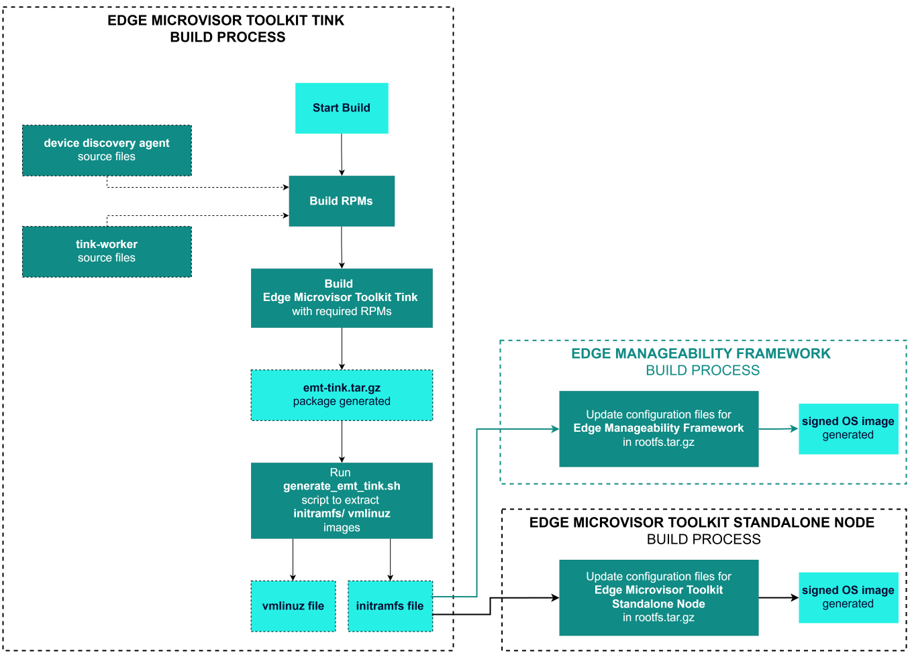

:::
orphan: true
:::

# Edge Microvisor Bootkit

Edge Microvisor Bootkit is a custom, minimal build of Edge Microvisor Toolkit.
It is intended for use in the Edge Microvisor
Toolkit Standalone Node. Bootkit has been introduced to replace previously used HookOS in
builds. It runs in RAM memory and installs the Edge Microvisor Toolkit operating system.

## Building the Bootkit image

Edge Microvisor Bootkit is built from the same baseline as other microvisor OS images
and is generated as a set of `initramfs` and `vmlinuz` image files. The characteristics of
the resulting image are defined in [edge-image-bootkit.json](https://github.com/open-edge-platform/edge-microvisor-toolkit/blob/26.06/toolkit/imageconfigs/edge-image-bootkit.json) configuration file. The OS includes
[base OS packages](https://github.com/open-edge-platform/edge-microvisor-toolkit/blob/26.06/toolkit/imageconfigs/packagelists/minimal-os-packages.json),
as well as
[Bootkit specific packages](https://github.com/open-edge-platform/edge-microvisor-toolkit/blob/26.06/toolkit/imageconfigs/packagelists/bootkit-packages.json).

Before you can build the image, make sure you have [installed prerequisites and built the toolchain](./get-started/emt-building-howto.md).
To build the Bootkit OS image, run the following command:

```bash
sudo make image -j8 REBUILD_TOOLS=y REBUILD_PACKAGES=n CONFIG_FILE=./imageconfigs/edge-image-bootkit.json
```

The build results in a compressed `emt-bootkit.tar.gz` file.

The `initramfs` and `vmlinuz` images are required to run entirely in RAM memory, so first
they need to be extracted from the generated tar file. It can be done by running
the [generate-bootkit-initramfs.sh](https://github.com/open-edge-platform/edge-microvisor-toolkit/blob/26.06/toolkit/imageconfigs/scripts/generate-bootkit-initramfs.sh) bash script. See the usage example:

```bash
sudo toolkit/imageconfigs/scripts/generate-bootkit-initramfs.sh \
  -f <emt-bootkit.tar.gz> -o <output_images_dir>
```

* The `<emt-bootkit.tar.gz>` is the output "rootfs.tar.gz" file generated by the Bootkit OS build.
* The `<output_images_dir>` is the folder where output `vmlinuz`/`initramfs` files will be placed.

Then, the "rootfs.tar.gz" file is added into the extracted `initramfs` image, which in turn is extracted to
`tmpfs` by the
[90tmpfsroot dracut module](https://github.com/open-edge-platform/edge-microvisor-toolkit/tree/26.06/SPECS/dracut/90tmpfsroot).
The dracut module decompresses the tar file to `tmpfs` to run as root during boot stage
of `initramfs`.

To boot with the `vmlinuz` and `initramfs` images, the following additional
kernel parameters are required:

```text
root=tmpfs rootflags=mode=0755 rd.skipfsck noresume modules-load=nbd
```

The generated `initramfs` and `vmlinuz` images can be used for implementing required
customizations in [Edge Microvisor Toolkit Standalone Node](#microvisor-build-with-bootkit-new-workflow) builds.

## Integration with Edge Microvisor Toolkit Standalone Node

The primary components in Edge Microvisor Bootkit, that is *device-discovery*,
*tink-worker* are built as RPMs (from open source) and included in an output *emt-bootkit.tar.gz* image file by
standard image build process of Edge Microvisor Toolkit (microvisor).

The output image file can then be transformed into `initramfs` and `vmlinuz` images required
to boot as a transitionary OS during provisioning workflows of Standalone Node. Then, the generated `initramfs` and `vmlinuz` images are used in Standalone Node image build processes, where specific
customizations for an edge node are also included. In result, the final signed images are
generated and can be used in provisioning of
the microvisor (Edge Microvisor Toolkit Standalone Node).

See the diagram for more details:



## Edge Microvisor Toolkit Standalone Node Specific Builds

### Microvisor Build with HookOS (previous workflow)

In [Edge Microvisor Toolkit Standalone Node](https://github.com/open-edge-platform/edge-microvisor-toolkit-standalone-node),
HookOS sources were implemented to
generate required HookOS images to be used in the installer. The
[installer scripts](https://github.com/open-edge-platform/edge-microvisor-toolkit-standalone-node/blob/main/standalone-node/hook_os/files/install-os.sh)
from Edge Microvisor Toolkit Standalone Node were built into the OS image and set up to run
automatically in bash on boot.

The customized HookOS `initramfs` and `vmlinuz` were then used to generate the required
ISO for the USB installer of
[Edge Microvisor Toolkit Standalone Node](https://github.com/open-edge-platform/edge-microvisor-toolkit-standalone-node).

### Microvisor Build with Bootkit (new workflow)

When using Edge Microvisor Bootkit in the build workflow, the
[installer scripts](https://github.com/open-edge-platform/edge-microvisor-toolkit-standalone-node/blob/main/standalone-node/provisioning_scripts/install-os.sh) from Edge Microvisor Toolkit Standalone Node
are added to run as native systemd services in the `initramfs` image:

Bootkit also includes efibootmgr, gawk, lvm2, net-tools, and parted packages to support creation of
Standalone Node build.

> **NOTE**: Before the final ISO image for the USB installer is generated, required OS
installer bash scripts and systemd service are added to the `initramfs` to run as services in
[Edge Microvisor Toolkit Standalone Node](https://github.com/open-edge-platform/edge-microvisor-toolkit-standalone-node).
