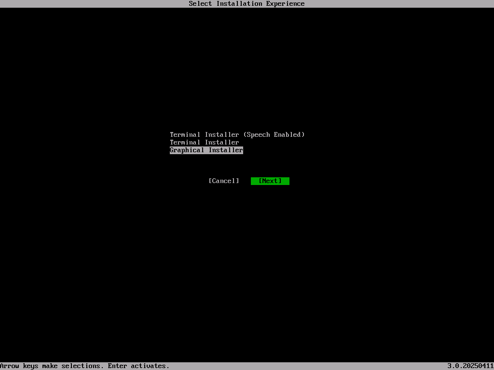
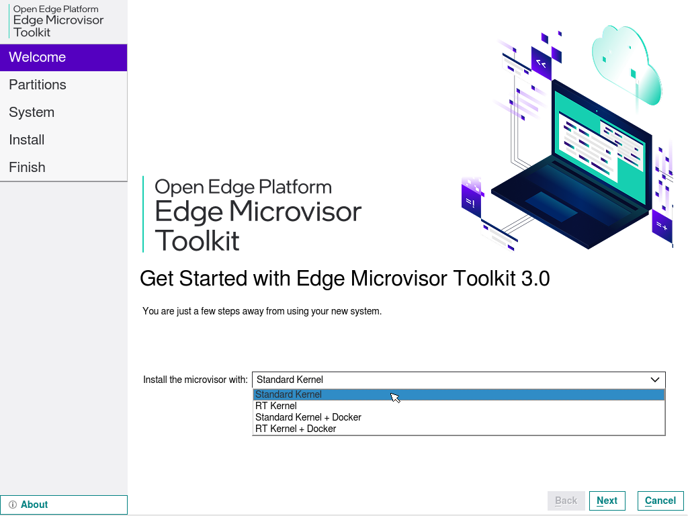
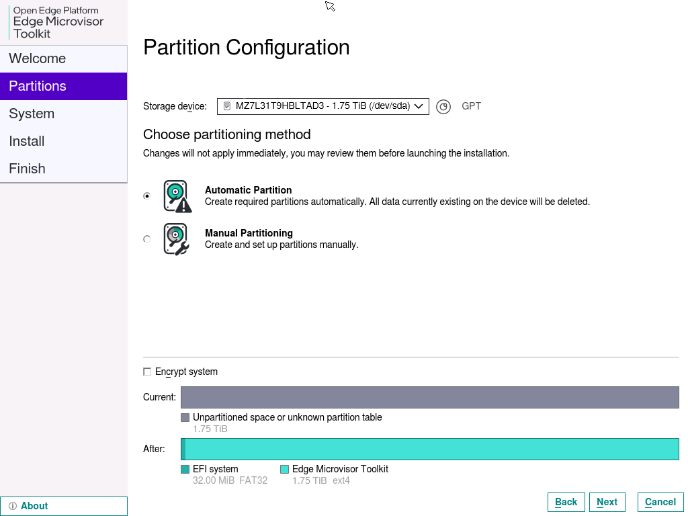
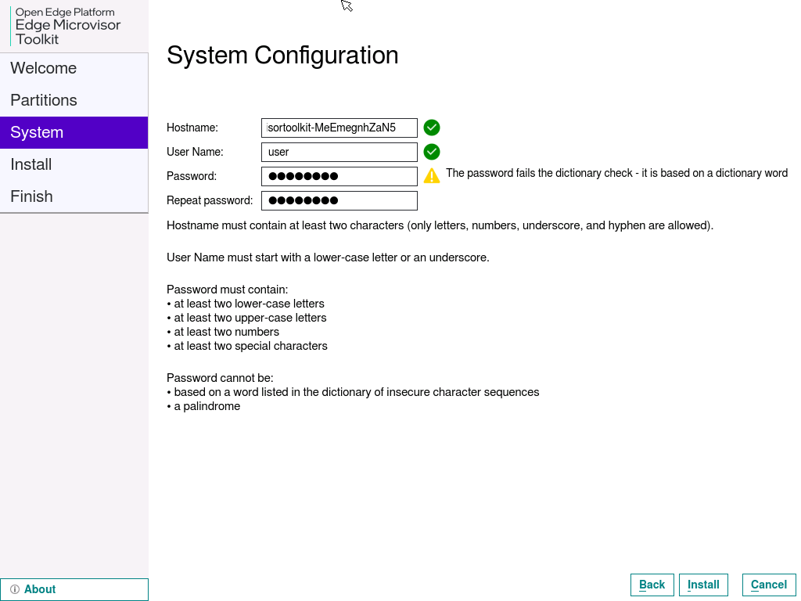
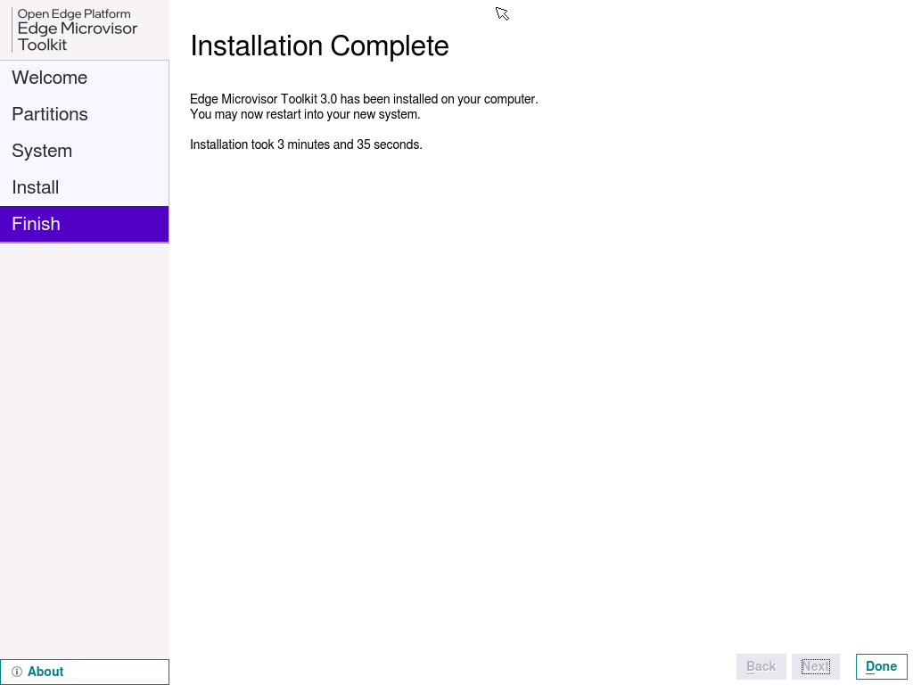

# Deploy Edge Microvisor Toolkit on Bare Metal

In this article, you will learn how to deploy Edge Microvisor Toolkit on bare metal using ISO or
RAW images.

## Requirements

- OS image of Edge Microvisor Toolkit Developer Node 3.1:
  - [ISO](https://files-rs.edgeorchestration.intel.com/files-edge-orch/microvisor/iso/EdgeMicrovisorToolkit-25.06.2.iso)
    \- [SHA256](https://files-rs.edgeorchestration.intel.com/files-edge-orch/microvisor/iso/EdgeMicrovisorToolkit-25.06.2.iso.sha256sum)

    The image above was created from the
    [25.06.02](https://github.com/open-edge-platform/edge-microvisor-toolkit/releases/tag/25.06.02)
    release.\
    For weekly builds, see
    [Announcements in GitHub Discussions](https://github.com/open-edge-platform/edge-microvisor-toolkit/discussions/categories/announcements).
- USB flash drive (min. 8GB)
- Access to the target machine
- Optional: monitor and keyboard, or BMC/iDRAC/iKVM access

## Create Bootable USB

### Flash the ISO

Download the
[ISO image](https://files-rs.edgeorchestration.intel.com/files-edge-orch/microvisor/iso/EdgeMicrovisorToolkit-25.06.2.iso)
and insert a USB drive.

#### On Linux OS

1. Compare the output of `lsblk` before and after inserting your USB drive to identify
its name (for example, `/dev/sdb`).

   ```bash
   lsblk
   ```

2. Flash the ISO Image. Use the `dd` command to write the ISO image.
Replace `/path/to/your.iso` with the ISO’s location and `/dev/sdb` with your USB drive.

   ```bash
   sudo dd if=/path/to/your.iso of=/dev/sdb bs=4M status=progress oflag=sync
   # Warning: Double-check the drive name. Using a wrong drive can overwrite data.
   ```

3. Sync and eject: Once `dd` has finished, run:

   ```bash
   sudo sync
   ```

   Then, safely remove the USB drive.

#### On Windows OS

Download and install ISO writer software such as [Rufus](https://rufus.ie/en) or
[Balena Etcher](https://etcher.balena.io/). The latter simplifies the process
to just selecting ISO image and target USB drive.

##### Rufus Workflow

If you decide to use Rufus, follow
the instructions below:

1. Insert the USB drive (8GB or more).
2. Launch Rufus.
3. Select the USB drive from the dropdown list.
4. Boot selection: Select your EMT 3.0 ISO file.
5. Image option: Leave default or choose *Standard Installation*.
6. Partition scheme: MBR (for legacy BIOS) or GPT (for UEFI).
7. File system: FAT32 (recommended).
8. Click *Start*.
9. Confirm warnings about data being erased.
10. Wait for completion and safely eject the USB.

Next, set up the target machine to [boot from the USB drive](#boot-from-usb) to
[install Edge Microvisor Toolkit Developer Node](#install-edge-microvisor-toolkit-developer-node).

### Flash the RAW Image

You can [Build](../emt-building-howto.md#build-the-edge-microvisor-toolkit-image) a custom
immutable RAW image from a chosen version of Edge Microvisor Toolkit.
You can use any [imageconfig JSON file](https://github.com/open-edge-platform/edge-microvisor-toolkit/tree/3.0-dev/toolkit/imageconfigs/)
that matches the **"edge-image\*.json"** file name pattern.
Make sure to [add user credentials](https://github.com/open-edge-platform/edge-microvisor-toolkit/blob/3.0-dev/docs/developer-guide/get-started/emt-building-howto.md#example-3-generating-user-passwords) to the JSON file before building
the image, so your custom system can operate correctly when booted.

Once you have built the image, flash it on a USB drive.

1. Navigate to the folder with the RAW image. Then, unpack the image by running the commands:

   ```bash
   gzip -d edge_microvisor_toolkit.raw.gz
   chmod -Rf 777 edge_microvisor_toolkit.raw
   ```

2. Flash the RAW image to a USB flash drive using the 'dd' command.

   ```bash
   sudo dd if=edge_microvisor_toolkit.raw of=/dev/sdc status=progress
   ```

   > **Note:** Successful flashing of the image should produce partitions such as `/dev/sdb`
     and `/dev/sdc`.

### Boot from USB

1. Insert the USB into the target machine.
2. Enter the BIOS/Boot menu.
3. Choose the USB drive as the boot device.

## Install Edge Microvisor Toolkit Developer Node

1. Choose *Terminal Installer* or *Graphical Installer* when prompted

   

   **Follow Installation Prompts**

2. Choose the installation type:

   .

3. Select the target disk for installation and choose the partitioning method.

   .

4. Skip disk encryption (optional).
5. Create a username and a password. Keep the default *Hostname*.

   .

6. Click *Install* and confirm by clicking *Install Now*.

7. When the installation has completed, click *Done* to close the installer.

   .

   The system will reboot.

   **You are now ready to use Edge Microvisor Toolkit!**

8. (Optional) Check the version of Edge Microvisor Toolkit by running the following command:

   ```bash
   cat /etc/os-release
   ```

## Install Edge Microvisor Toolkit Standalone Node

To deploy a selected version of Edge Microvisor Toolkit Standalone Node, build the OS image
and prepare a bootable USB drive, using
[source code](https://github.com/open-edge-platform/edge-microvisor-toolkit-standalone-node/blob/main/standalone-node/docs/user-guide/get-started-guide.md#prerequisites).

Edge Microvisor Toolkit Standalone Node can be installed from one of available OS
image versions:

- Edge Microvisor Toolkit Non-RT (default)
- Edge Microvisor Toolkit Desktop Virtualization
- [Immutable custom build](../emt-building-howto.md) of Edge Microvisor Toolkit Developer Node

## Enable X11 Desktop UI in ISO Image for Edge Microvisor Toolkit Developer Node

(Optional) If you would like to enable the X11 desktop UI in the ISO image for Edge Microvisor Toolkit Developer Node, see [Enable X11 Desktop UI in ISO Image for Edge Microvisor Toolkit Developer Node](../../tutorials/emt-x11-desktop-ui.md).