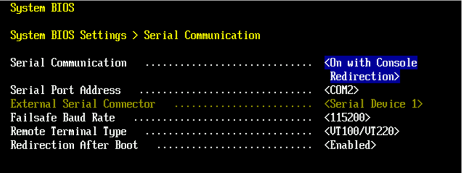
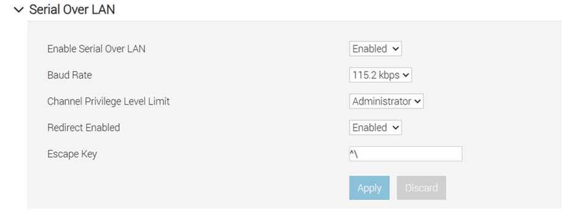
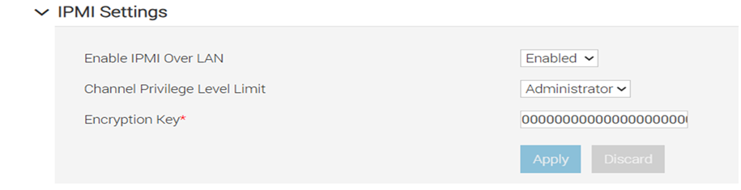
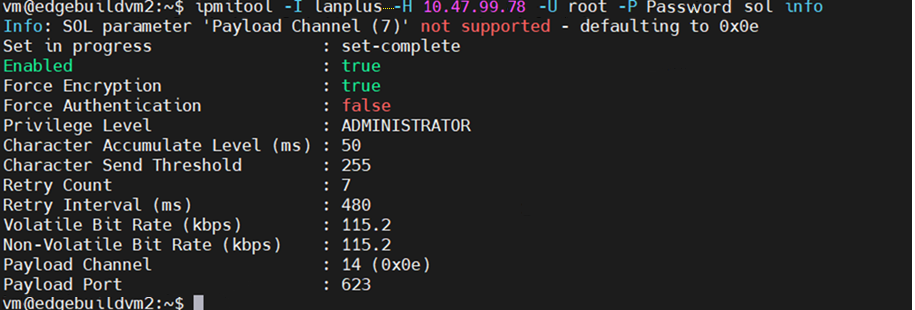
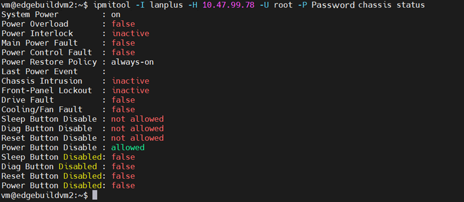

# Deploy Edge Microvisor Toolkit via Serial over LAN (SOL)

In this article, you will learn how to deploy Edge Microvisor Toolkit using the
Serial over LAN (SOL) method.

Traditional methods such as KVM consoles, physical serial connections, or SSH
have been commonly used to access and manage servers. However, they have certain
limitations, especially during system boot or failure conditions. SSH depends
on the operating system and network services being fully operational, while KVM
requires graphical access, and physical serial connections often require direct
cabling to server.

Serial Over LAN (SOL) addresses these limitations by redirecting the server’s
serial console input and output over a network connection through the management
controller, allowing administrators to remotely access the server’s text-based
console, including BIOS and boot messages, even when the operating system is not
running.

This enables remote troubleshooting and management without requiring physical
access or additional serial cabling.

Testing Serial over LAN (SOL) in a BMC (Baseboard Management Controller)
environment usually involves verifying that the host serial console is redirected
through the BMC network interface and accessible remotely via IPMI

Below you will find the necessary configuration for SOL to work.

## Prerequisites

- The BMC IP address configured.
- A Management LAN cable connected to the BMC port.
- ipmitool installed on the client system.
- The host serial console redirection enabled.

## Configure BIOS Settings on Server

Configure BIOS for serial redirection. Navigate to
**System setup ->  System BIOS  -> Serial Communication**



## Configure SOL Settings on Xeon BMC

Open WebUI of BMC through BMCIP. Navigate to
**iDRAC Settings -> Connectivity -> Serial Over LAN**.



## Remote Client (ipmi) settings in XEON BMC

Configure the IPMI settings. Navigate to
**iDRAC Settings -> Connectivity -> Network -> IPMI Settings**.



## Set up the remote client

> **Note:** You should run all IPMI commands on the client machine.

To set up the remote client machine, you need to install ipmi:

```bash
sudo apt install ipmi
```

## Manage SOL (Serial Over LAN) session

1. Start a SOL session.

   ```bash
   ipmitool -I lanplus -H <BMC-IP> -U admin -P password sol activate
   ```

2. Stop the SOL session.

   To stop the active SOL session, run the following command:

   ```bash
   ~.
   ```

   You can also stop it from another shell on the client machine by running:

   ```bash
   ipmitool -I lanplus -H <BMC-IP> -U admin -P password sol deactivate
   ```

3. Check the SOL configuration.

   ```bash
   ipmitool -I lanplus -H <BMC-IP> -U admin -P password sol info
   ```

   To learn more about ipmitool commands, refer to the guides at
   [linux.die.net](https://linux.die.net/man/1/ipmitool) or
   [ibm.com](https://www.ibm.com/docs/en/power9/0000-REF?topic=POWER9_REF/p9eih/p9eih_ipmi_commands.html).

## Verify SOL configuration

> **Note:**
> The settings have been configured and tested on the DELL R760 server.
> They have been executed from a remote client and verified with the
> latest EMT 3.0 ISO image.

1. To verify the configuration, run the following command:

   ```bash
   ipmitool -I lanplus -H <BMC-IP> -U admin -P password sol info
   ```

   

2. For system status information, run:

   ```bash
   ipmitool -I lanplus -H 10.47.99.78 -U root -P Password chassis status
   ```

   

3. Activate the SOL session on the client and reboot the server.

   ```bash
   vm@edgebuildvm2:~$ ipmitool -I lanplus -H 10.47.99.78 -U root -P Password sol activate
   ```

   Output:

   ```text
   [SOL Session operational.  Use ~? for help]
   KEY MAPPING FOR CONSOLE REDIRECTION:

   Use the <ESC><1> key sequence for <F1>
   Use the <ESC><2> key sequence for <F2>
   Use the <ESC><3> key sequence for <F3>
   Use the <ESC><0> key sequence for <F10>
   Use the <ESC><!> key sequence for <F11>
   Use the <ESC><@> key sequence for <F12>

   Use the <ESC><Ctrl><M> key sequence for <Ctrl><M>
   Use the <ESC><Ctrl><H> key sequence for <Ctrl><H>
   Use the <ESC><Ctrl><I> key sequence for <Ctrl><I>
   Use the <ESC><Ctrl><J> key sequence for <Ctrl><J>

   Use the <ESC><X><X> key sequence for <Alt><x>, where x is any letter
   key, and X is the upper case of that key

   Use the <ESC><R><ESC><r><ESC><R> key sequence for <Ctrl><Alt><Del>

   Press the spacebar to pause...
   Initializing PCIe, USB, and Video... Done
   PowerEdge R760
   BIOS Version: 2.2.7
   Console Redirection Enabled Requested by iDRAC

   F2       = System Setup
   F10      = Lifecycle Controller (Config
              iDRAC, Update FW, Install OS)
   F11      = Boot Manager
   F12      = PXE Boot
   iDRAC IPV4:  10.47.99.78 [Dedicated]
   Initializing Firmware Interfaces...

   Enumerating Boot options...
   Enumerating Boot options... Done
   Loading Lifecycle Controller Drivers...
   Loading Lifecycle Controller Drivers...Done
   Lifecycle Controller: Collecting System Inventory...

   iDRAC IPV4:  10.47.99.78 [Dedicated]
   Lifecycle Controller: Done
   Booting...
   Booting from PCIe SSD in Slot 23 in Bay 1: Edge Microvisor Toolkit
   Welcome to GRUB!
     Booting `EdgeMicrovisorToolkit GNU/Linux, with Linux 6.12.67-1.emt3'
   Loading Linux 6.12.67-1.emt3 ...
   Loading initial ramdisk ...
   ```

4. Exit the SOL session.

   Use `~.` in the current session, or `ipmitool sol deactivate`
   from another active session.
