# Deploying Edge Microvisor Toolkit using EMT VIRT Guest Virtual Machines

This article will guide you through setup and configuration of Virtual Machine Guest OS under Ubuntu 22.04 Host OS. The four supported OS are Anroid, Yocto, Windows 10 and Ubuntu.

## Android

The sections below describe setup, running and configuration of Android VM using EMT Virt.

### Setup Android VM

#### Android VM Setup Prerequisites

##### Build requirements

- A 64-bit development workstation running Ubuntu 22.04 (Jammy Jellyfish) operating system.
- Python 3.6+ is supported. This is mainly to be aligned with the latest repo command released by Google.
- Around 350 GB of free disk space on your workstation is required to checkout the source code and to store the build artifacts.

##### Celadon Development Environment Setup

1. Create a local `bin/` directory, download the repo tool to that directory, and make the binary executable with the following commands:

```bash
 mkdir -p ~/bin
curl https://storage.googleapis.com/git-repo-downloads/repo >
~/bin/repo
chmod a+x ~/bin/repo
export PATH=~/bin:$PATH
```

2. Install the following required packages on your 64-bit Ubuntu 22.04 LTS development workstation prior to the compilation:

```bash
 sudo apt-get update
sudo apt-get install -y wget openjdk-8-jdk git ccache \
 automake lzop bison gperf build-essential zip curl \
 zlib1g-dev g++-multilib python3-networkx \
 libxml2-utils bzip2 libbz2-dev libbz2-1.0 \
 libghc-bzlib-dev squashfs-tools pngcrush \
 schedtool dpkg-dev liblz4-tool make optipng maven \
 libssl-dev bc bsdmainutils gettext python3-mako \
 libelf-dev sbsigntool dosfstools mtools efitools \
 python3-pystache git-lfs python-is-python3 flex clang \
 libncurses5 fakeroot ncurses-dev xz-utils cryptsetup-bin \
 apt-transport-https ca-certificates curl lsb-release \
 rsync vim python-six kmod glslang-tools \
 software-properties-common cpio python3-pip ninja-build \
 cutils cmake pkg-config xorriso mtools libjson-c-dev file
sudo pip3 install meson==0.60.0 mako==1.1.0 dataclasses
pycryptodome ply==3.11
```

3. Setup git config required for `repo init` on the build server.

```bash
# Setup git config with your name and email ID. Add proxy
settings if behind a firewall
cd /home/$USER
vi /home/$USER/.gitconfig
# Append below lines to .gitconfig file
[user]
email = <your email>
name = <your name>
[http]
proxy = <http_proxy>
[https]
proxy = <https_proxy>
```

##### Celadon Source Requirements

- `Vertical_RPL_SRIOV_CIV_WW2445_EXT.xml` from the release package [RPL-S_RPL-SR_KVM_MultiOS.zip](https://www.intel.com/content/www/us/en/secure/design/confidential/software-kits/kit-details.html?kitId=839117)

##### Building Celadon from Source

1. Initialize the repository and sync Celadon source workspace:

```bash
# Init with the default manifest
repo init -u https://github.com/projectceladon/manifest.git
# Copy RPL CIV manifest and use it
cp <source path>/Vertical_RPL_SRIOV_CIV_WW2445_EXT.xml
.repo/manifests/
repo init -m Vertical_RPL_SRIOV_CIV_WW2445_EXT.xml
# Sync the code and setup
repo sync -c -j16
repo forall -c git lfs pull
```

> **Note:** Depending on network conditions, the sync may take several hours.

2. Build Android CIV release:

```bash
# Perform the environment setup from directory where repo is
initialized
source build/envsetup.sh
# Select userdebug variant
lunch caas-userdebug
# Start the build
make flashfiles BASE_LTS2020_YOCTO_KERNEL=true -j16
```
3. Find the required output files for use in setup:

```bash
# Get location of CIV build output
find pub -name caas-releasefiles*.tar.gz
pub/caas/userdebug/caas-releasefiles-userdebug.tar.gz
```

4. Copy the packaged `caas-releasefiles-userdebug.tar.gz` file to the host.

#### Host setup

##### Host OS Hardening

Users of Celadon-in-VM (CIV) release must ensure that Celadon platform host OS hardening measures are in place to ensure that the host OS could be treated as part of the secure computing base. This is essential to ensuring CIV security could be trusted in CIV operations.
For Celadon Host OS hardening recommendations see [this document.](https://projectceladon.github.io/celadon-documentation/getting-started/host-os￾hardening.html)

##### Add Celadon Guest VM Support to RPL Host OS

1. Copy `caas-releasefiles-userdebug.tar.gz` to the host:

```bash
# Copy the artifact
cp caas-releasefiles-userdebug.tar.gz /home/$USER
```

2. Extract the package:

```bash
# Extract files
cd /home/$USER
tar xzvf caas-releasefiles-userdebug.tar.gz
```

3. Run the host setup:

```bash
# Update the host
sudo -E ./scripts/setup_host.sh
```

4. After the setup has completed, reboot the host:

```bash
sudo reboot
```

#### Creating Android VM Image

Create Android CIV image for running as VM on the host device:

```bash
# Change directory
cd /home/$USER
# Generate CIV disk image from caas-flashfiles.
# The script and flashfiles have already been extracted from
caas-releasefiles-userdebug.tar.gz
# Wait for "Flashing is completed" msg from script.
sudo -E ./scripts/start_flash_usb.sh caas-flashfiles￾xxxxx.zip --display-off
```

### Running Android VM

#### Android VM Running Prerequisites

##### Android Guest VM Launch Scripts

On the Ubuntu host OS download the launch script `ubuntu_kvm_multios_scripts.zip` from the release package [RPL-S_RPL-SR_KVM_MultiOS.zip](https://www.intel.com/content/www/us/en/secure/design/confidential/software-kits/kit-details.html?kitId=839117).

> **Note:** If you have performed the Host kernel setup in Section 4.2, the ZIP files and all the script files should already be in the system.

#### Launch Celadon Android Guest VM

Run the following:

```bash
# Launch the Android CIV Guest VM
cd /home/$USER
sudo -E vm-manager -b Android-CIV1
```

#### Launch Multiple Android Guest VM

1. Create a second or subsequent images with the script shown below:

```bash
# Command is: sudo -E ./scripts/setup_multi_civ_vm.sh -c N
# where N is the number of images to be created
# (names will be Android-CIV2, Android-CIV3 etc.)
#
# Example to create 2 additional images
sudo -E ./scripts/setup_multi_civ_vm.sh -c 2
```

2. Create a `start_all_android.sh` script to launch multiple guests as shown below.

> **Note:** The amount of memory and cores allocated might be different according to each platform.

```bash
#!/bin/bash
# Sample script to launch multiple Android guests
# Remember to customise the launch commands according to HW
setup and use case:
# - number of guests
# - memory allocated
# - core allocated
# Propagate signal to children
trap 'trap " " SIGTERM; kill 0; wait' SIGINT SIGTERM
# Start Android multi guests
echo "Starting Android Guest1..."
sudo -E vm-manager -b Android-CIV1 &
echo "Starting Android Guest2..."
sudo -E vm-manager -b Android-CIV2 &
echo "Starting Android Guest3..."
sudo -E vm-manager -b Android-CIV3 &
wait
```

3. Launch the guest VMs:.

```bash
# Launch the guest VMs
chmod +x ./start_all_android.sh
./start_all_android.sh
```

#### Android Guest VM Configuration

##### Changing Android Guest VM Memory and Number of CPUs

For Android 12 Guest VM edit the `memory` and `vcpu` sections of the configuration INI file at `/home/$USER/.intel/.civ/Android-CIV1.ini`

```bash
[memory]
size=4G
[vcpu]
num=4G
```

##### Enabling USB Devices in Android Guest VM

To enable USB Devices in the host VM you can use a passthrough that enables selected USB devices. For Android 12 guest VM the passthrough is defined in the configuration INI file.

1. Find the PCI ID of the USB device:

```bash
lspci -nn -D | grep USB
0000:00:14.0 USB controller [0c03]: Intel Corporation Device
[8086:7ae0] (rev 11)
0000:00:14.1 USB controller [0c03]: Intel Corporation Device
[8086:7ae1] (rev 11)
0000:05:00.0 USB controller [0c03]: Intel Corporation
Thunderbolt 4 NHI [Maple Ridge 4C 2020] [8086:1137]
0000:07:00.0 USB controller [0c03]: Intel Corporation
Thunderbolt 4 USB Controller [Maple Ridge 4C 2020] [8086:1138]
```

2. Edit the passthrough section of the configuration INI file at `/home/$USER/.intel/.civ/Android-CIV1.ini`

```bash
[passthrough]
#specified the PCI id here if you want to passthrough it to
guest, separate them with comma
passthrough_pci=0000:00:14.0,0000:00:14.1,0000:05:00.0,0000:07:
00.0,
```

##### Enabling PCIe Wi-Fi Adapter Device in Android Guest VM**

1. Find the PCI ID of the Wi-Fi device:

```bash
lspci -nn -D | grep Wi-Fi
0000:02:00.0 Network controller [0280]: Intel Corporation Wi-Fi
6 AX210/AX211/AX411 160MHz [8086:2725] (rev 1a)
```

2. Edit the passthrough section of the configuration INI file at `/home/$USER/.intel/.civ/Android-CIV1.ini`

```bash
[passthrough]
#specified the PCI id here if you want to passthrough it to
guest, separate them with comma
passthrough_pci=0000:02:00.0
```

##### Enabling Logging for Android 12 Guest VM**

1. Ensure that the Android 12 guest VM is not running. Edit the extra section of the configuration INI file at `/home/$USER/.intel/.civ/Android-CIV1.ini`

```bash
[extra]
cmd=-chardev socket,id=ch0,path=/tmp/civ1-
console,server=on,wait=off,logfile=/tmp/civ1_serial.log -serial
chardev:ch0
```

2. Connect to Android 12 Guest VM console for debugging:

```bash
# Connect to Celadon guest console
sudo socat unix-connect:/tmp/civ1-console stdio
```

## Yocto

The sections below describe setup, running and configuration of Yocto VM using EMT Virt.

### Setup Yocto VM

#### Yocto VM Prerequisites

##### Build Yocto Project Image

Refer to “Yocto Project-based Board Support Package for 13th Gen Intel® Core™
Processors and Intel® Core™ Processors (14th Gen) for Edge Platforms Get Started
Guide” document [788647](https://cdrdv2.intel.com/v1/dl/getContent/788647) for prerequisites to build Yocto Project* - based BSP for
RPL platform

<!-- 788647 RESTRICTED LINK - PUBLIC RESOURCE REQUIRED -->

##### Copy Yocto Project Image

After the Yocto build has completed,rename the output image to yocto.wic and copy it to the RPL host device.

```bash
cd ./build/tmp-x86-glibc/deploy/images/intel-corei7-64/
sudo mv core-image-sato-sdk-intel-xxxx.wic
/home/$USER/yocto.wic
```

##### Make a Separate Copy of OVMF for Yocto

Create a separate copy of OVMF for Yocto Project VM use.

```bash
# Make a copy of OVMF for Yocto guest
ln -sf ovmf/OVMF_CODE.fd OVMF_CODE.fd
cp ovmf/OVMF_VARS.fd OVMF_VARS_yocto.fd
```

### Running Yocto VM

#### Yocto VM Running Prerequisites

##### Yocto Guest VM Launch Scripts

On the Ubuntu host download the launch script `ubuntu_kvm_multios_scripts.zip` from the release package [RPL-S_RPL-SR_KVM_MultiOS.zip](https://www.intel.com/content/www/us/en/secure/design/confidential/software-kits/kit-details.html?kitId=839117)

> **Note:** If you have performed the Host kernel setup in Section 4.2, the ZIP files and all the
scriptfiles should already be in the system.

#### Launch Yocto Project* Guest VM

```bash
# Change directory
cd /home/$USER
# Launch the Yocto Guest VM
sudo -E ./start_yocto.sh
```

#### Yocto VM Configuration Options

##### Changing Yocto Guest VM Memory and Number of CPUs

The default launch command without any parameters is for 2 cores and 2G RAM. You can change that with startup parameters.

Example guest start configuration for 4 cores, 4G RAM:

```bash
# Add -m option to specify 4G of memory
# Add -c option to specify 4 cpu cores for guest VM
sudo -E ./start_yocto.sh -m 4G -c 4
```

##### Enabling USB Devices in Guest VM**

For Yocto guest VMs, USB devices can be setup in two ways:

1. Passthrough of all USB Host Devices.

USB host passthrough parameter option can be added in the launch command to passthrough all USB devices on the USB host.

Add an additional parameter to the Guest VM launch command:

```bash
# Note: all connected USB devices will be passthrough to the
guest VM with USB host passthrough option
sudo -E ./start_yocto.sh --passthrough-pci-usb
```

2. Passthrough of specific USB Device

An external command option can be used to passthrough only a few selected USB devices.

Retrieve the `vendorid` and `productid` of USB device. In this example, ‘046d’ is vendor
ID, ‘c06a’ is product ID.

```bash
# On target terminal.
lsusb
Bus 004 Device 003: ID 046d:c06a Logitech, Inc. USB Optical
Mouse
```

Add an additonal parameter to the Guest VM launch command:

```bash
# Add extra command when start guest
sudo -E ./start_yocto.sh -e "-device usb￾host,vendorid=0x046d,productid=0xc06a"
```

> **Note:** A passthrough device option can only be used once because a device can be passed through to only 1 guest VM at a time.

##### Enabling PCIe Wi-Fi Adapter Device in Yocto Guest VM

For Yocto guest VMs, PCI Wi-Fi device passthrough can be setup by adding `--passthrough-pci-wifi` parameter to guest VM launch command:

```bash
# Add --passthrough-pci-wifi for passing through Wifi adapter
sudo -E ./start_yocto.sh --passthrough-pci-wifi
```

## Windows 10

The sections below describe setup, running and configuration of Windows 10 VM using EMT Virt.

### Setup Windows 10 VM

#### Windows 10 VM Setup Prerequisites

##### Windows 10 Installation Image Required

Download the Windows 10 IOT Enterprise version 21H2 iso image, save it as windows.iso and copy it to the host

##### Windows 10 Guest VM - Required Installation Scripts

Use the script `ubuntu_kvm_multios_scripts.zip` from the release package [RPL-S_RPL-SR_KVM_MultiOS.zip](https://www.intel.com/content/www/us/en/secure/design/confidential/software￾kits/kit-details.html?kitId=839117)

#### Creating Windows VM Image

##### Create Windows VM Image from ISO

1. Create an empty Windows Guest VM image file along with the Windows OVMF files:

```bash
cd /home/$USER/
qemu-img create -f qcow2 win.qcow2 80G
ln -sf ovmf/OVMF_CODE.fd OVMF_CODE.fd
cp ovmf/OVMF_VARS.fd OVMF_VARS_windows.fd
```

2. Run `install_windows.sh` to start Windows guest installation:

```bash
# Start guest VM to install Windows
cd /home/$USER/
sudo ./install_windows.sh
```

> **Note:** If you miss the `Press Any Key` message, press ESC key until you reach the EFI shell prompt, then type `reset` to start over again.

3. Follow the Windows installation steps until you see the Windows Setup screen. Select **Windows 10 IoT Enterprise LTSC** option:

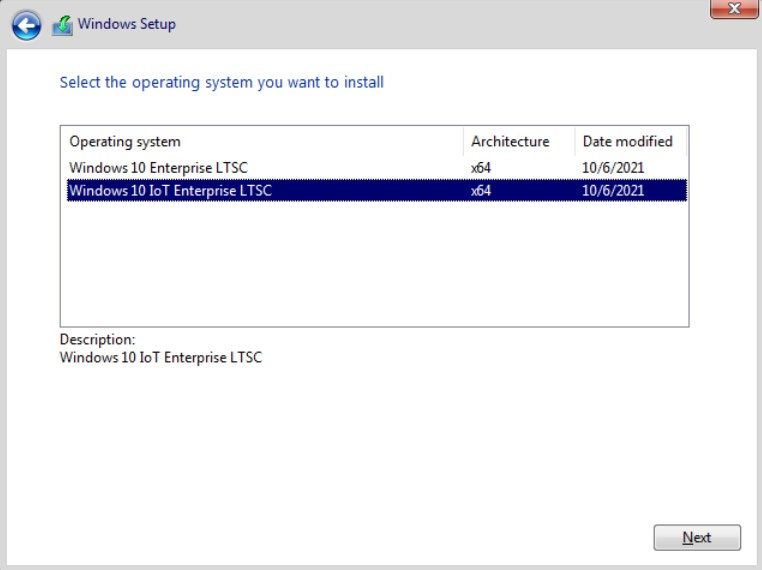

4. Select **Custom: Install Windows only (advanced)**:

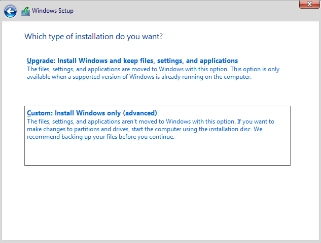

5. Select **Drive 0 Unallocated Space** and click **Next**:

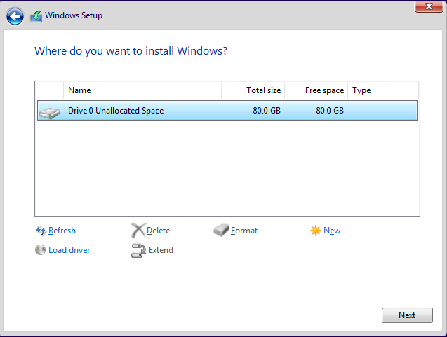

6. Follow the normal Windows installation steps. Windows will be installed to `win.qcow2`.

7. Once the installation is done, disable the automatic updates temporarily with the following steps:

  a. Open Settings.
  b. Click on Update & Security.
  c. Click on Windows Update.
  d. Click the Pause updates for 7 days button.

8. Shut down the Windows guest.

> **Note:** Remember to shut down the Windows Guest properly.

#### Prepare Windows* Guest VM for SR-IOV Zero Copy

##### Launch Windows Guest VM and Install Drivers

1. From Ubuntu GUI, launch Windows guest VM with `start_windows.sh`:

```bash
# Start guest VM to install Windows drivers
cd /home/$USER/
sudo ./start_windows.sh
```

##### Install Windows 10 Cumulative Update

1. Download **2024-05 Cumulative Update for Windows 10 Version 21H2 for x64-
based Systems** [KB5037768](https://catalog.s.download.windowsupdate.com/c/msdownload/update/software/secu/2024/05/windows10.0-kb5037768-x64_a627ecbec3d8dad1754d541b7f89d534a6bdec69.msu)

2. Double-click the MSU the update.

3. After successful installation reboot the Windows Guest VM.

4. Open a command prompt in administrator mode and enter `winver` to check the
version. It should show **21H2 OS Builds 19044.4412**.

##### Install Graphics GFX Driver

1. Download Intel® Graphics Driver Production Driver Version 101.5972 for IOTG Raptor Lake Virtualization Designs Only [GFX-prod-hini-releases_24ww30-ci-master-17071-osnext-pr-1015972-ms-attestation-sign-832-RPL-Rx64_v1.zip](https://www.intel.com/content/www/us/en/secure/design/confidential/software-kits/kit-details.html?kitId=837935)

2. Use File Explorer to extract the ZIP file.

3. Navigate into the install folder and double click on `installer.exe` to launch the installer.

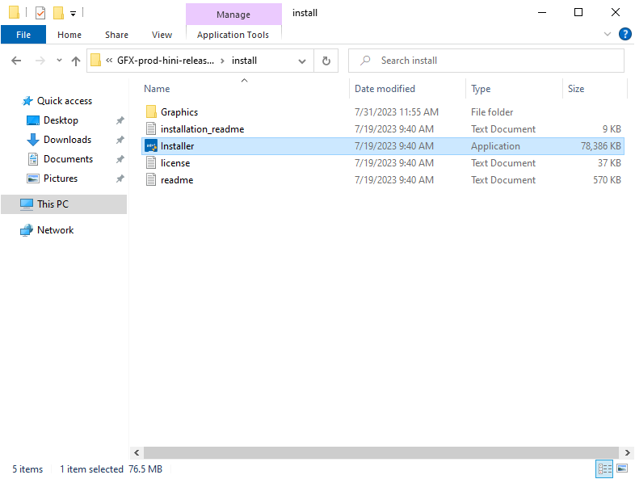

4. Click the **Begin installation** button.

5. After the installation has completed, reboot the Windows guest VM.

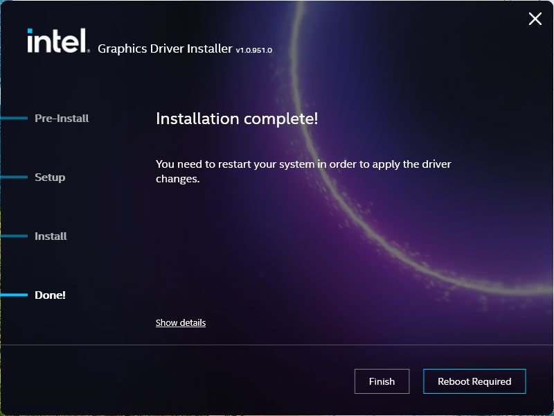

6. Launch the **Device Manager** to verify the installation.

7. Expand the **Display Adapters** item in the device list.

8. Right-click on the graphics device and select **Properties**. Click on the **Driver** tab. Check that the Intel® Graphics version is **32.0.101.5972**.

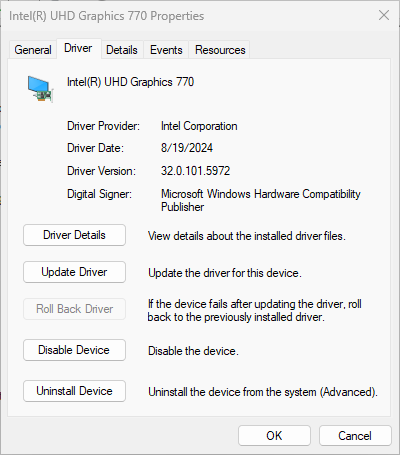

> **Note:** If you see the yellow triangle with exclamation, please install the driver manually by selecting the 32.0.101.5972 version. (Right-click to update the driver and select the option to point to the main installation directory.)

##### Prepare SR-IOV Zero Copy Driver

1. Download Windows Zero Copy Drivers Release 1716 [DVServer, DVServerKMD] [ ZCBuild_1716_MSFT_Signed_Installer.zip](https://www.intel.com/content/www/us/en/download/837886/display-virtualization-drivers-for-display-virtualization-drivers-for-alder-lake-s-beta-raptor-lake-ps-mr1-raptor-lake-sr-mr3-raptor-lake-s-mr5-raptor-lake-p-mr3-alder-lake-n-mr6-alder-lake-ps-mr7.html)

Please make sure the correct **ZCBuild** version is chosen from the drop-down. By
default, the latest **ZCBuild** version will be the first one.

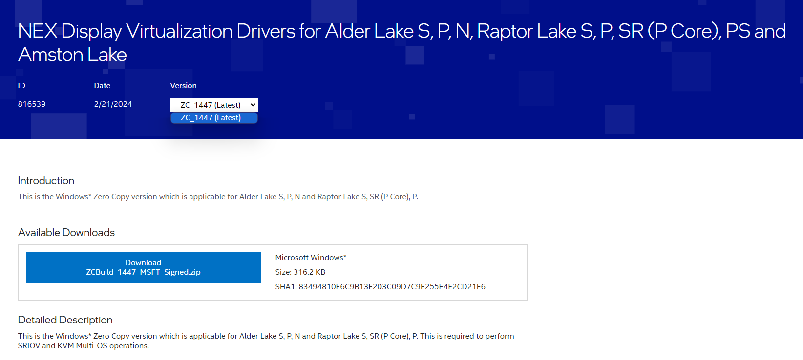

2. Use **File Explorer** to extract the ZIP file.

##### Install SR-IOV Zero Copy Driver Using GUI Installer

The **SR-IOV Zero Copy Driver** can be installed either with the GUI installer or through the command line. This section describes the steps for the GUI installer.

1. Go to the directory containing **ZeroCopyInstaller**.

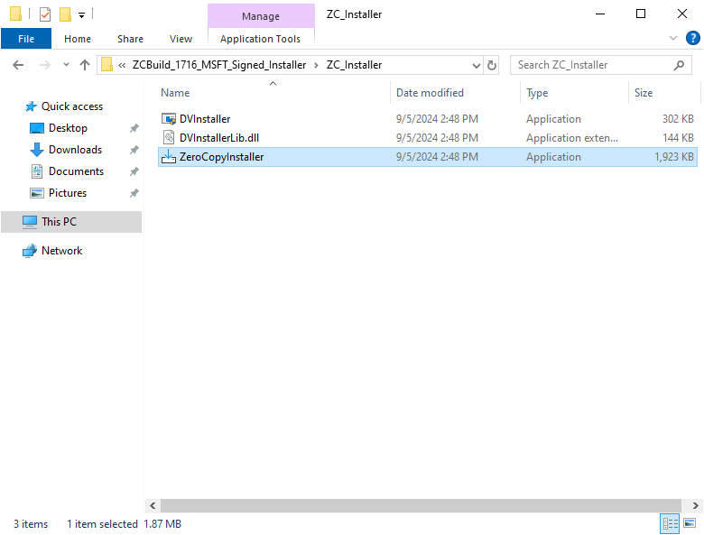

2. Double-click to run the **ZeroCopyInstaller**.

3. Click on the **Install** button when prompted.

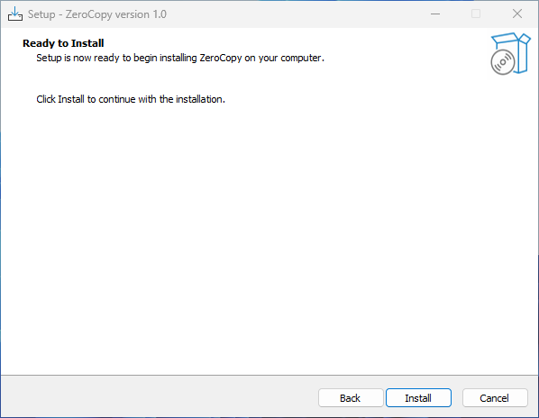

4. Once the installation has completed, click on the **Finish** button to restart Windows.

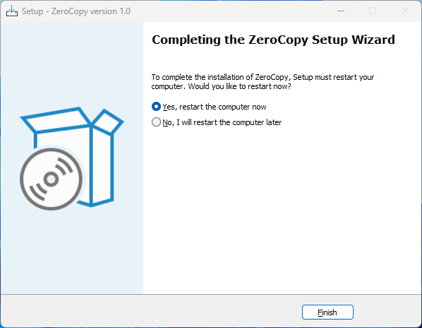

##### Install the SR-IOV Zero Copy Driver Using Command Line

The SR-IOV Zero Copy Driver can be installed either with the GUI installer or through
the command line. This section describes the steps to install it using command line.

1. Open Powershell in administrator mode.

2. Go to the directory containing **ZeroCopyInstaller**.

3. Enter the following to perform the installation.

```shell
C:\> .\ZeroCopyInstaller.exe /VERYSILENT /SUPPRESSMSGBOXES
```

> **Note:** Option usage details:
    - `/VERYSILENT` Runs silently without displaying windows
    - `/SUPPRESSMSGBOXES` Suppresses message boxes from displaying
    - `/NORESTART` Avoids restarting the system after installation.

4. Wait for the the Windows guest OS to automatically restart.

##### Verify the SR-IOV Zero Copy Driver Installation**

1. Launch the Device Manager to verify the installation.

2. Expand the **Display Adapters** item in the device list.

3. Right-click on the **DVServerUMD** device and select **Properties**. Switch to the
**Driver** tab. Check that the DVServerUMD Device Driver version is **4.0.0.1716**.

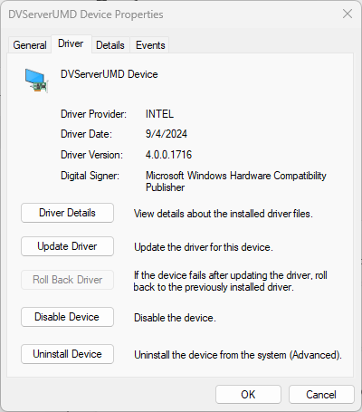

4. In **Device Manager**, expand the **System Devices** item in the device list.

5. Right-click on the **DVServerKMD** device and select **Properties**. Switch to the
**Driver** tab. Check that the **DVServerKMD** Device Driver version is **4.0.0.1716**.

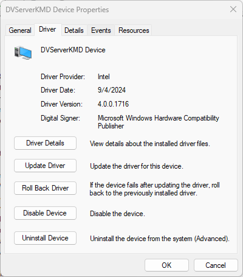

6. Start **Task Manager** and check that the GPU status is active as shown below:

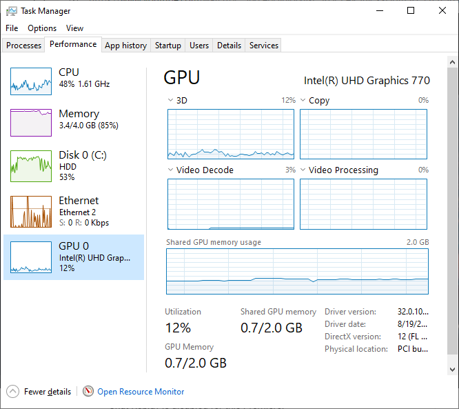

#### Disable Graphics Driver Updates

The installed graphics driver version has been verified to work with the Zero Copy driver to provide the SR-IOV feature. However, since there is a possibility that future versions of the graphics driver may be incompatible, it is necessary to prevent Windows Update from updating the graphics driver.

##### Identify the Graphics Hardware ID

1. Launch the **Device Manager**.

2. Expand the **Display Adapters** item in the device list.

3. Right-click on the graphics device and select **Properties**.

4. Switch to the **Details** tab and select **Hardware IDs** from the **Property** pull-down list

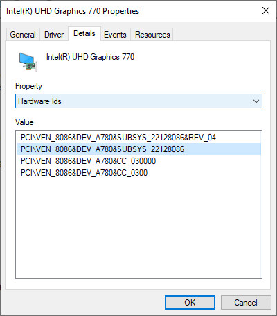

5. Right-click on the second ID in the list and select **Copy** from the context menu.

##### Enable Group Policy to Disable Graphics Driver Update

1. Type `gpedit.msc` in the search bar and launch the **Group Policy Editor**.

2. On the left pane, navigate to **Computer Configuration -> Administrative
Templates -> System -> Device Installation -> Device Installation Restrictions**.

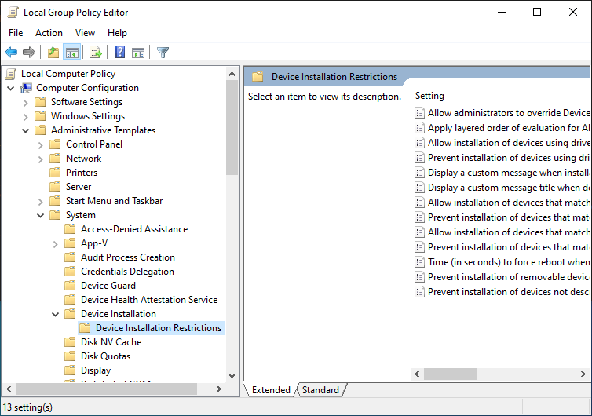

3. On the right pane, double-click on **Prevent installation of devices that match any
of these device IDs** to display additional options to configure.

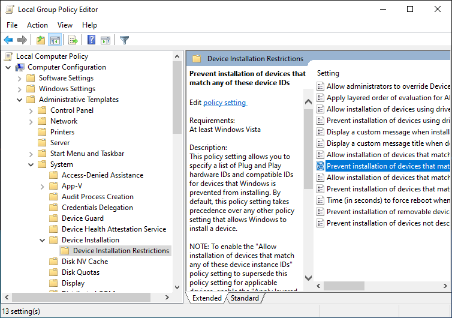

4. In the new pop-up window, click the **Enabled** radio button.

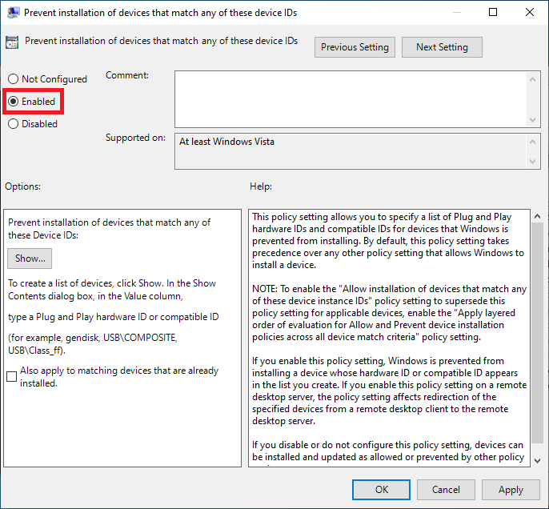

5. Click on the **Show…** button to bring up a new window. Enter the device hardware ID copied earlier.

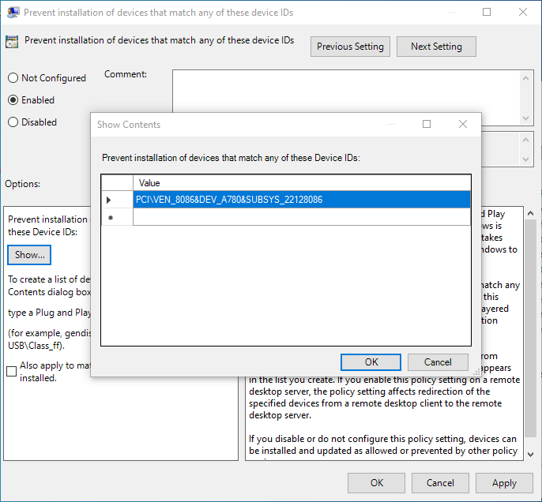

##### Resume Windows Update

1. Resume the automatic Windows updates (excluding the Graphics driver) with the following steps:

  a. Open Settings
  b. Click on Update & Security
  c. Click on Windows Update.
  d. Click the Resume updates button

##### Install Virtio Driver for Windows

1. Download [virtio-win-0.1.221.iso](https://fedorapeople.org/groups/virt/virtio-win/direct-downloads/archive-virtio/virtio-win-0.1.221-1/virtio-win.iso)

2. Double click the ISO file in the **File Explorer** to mount it.

3. Type `Windows PowerShell` in a search box and run it as administrator.

4. Navigate to the folder containing the extracted files.

5. Use the following command to install **VIOSerial**"

```shell
D:\> pnputil.exe /add-driver
.\vioserial\w10\amd64\vioser.inf /install
```

6. Use the following command to install `qemu-guest-agent`

```shell
D:\> Start-Process .\guest-agent\qemu-ga-x86_64.msi
```

### Running Windows 10 VM

#### Windows 10 VM Running Prerequisites

##### Windows 10 Guest VM Launch Scripts

On the Ubuntu host download the launch script `ubuntu_kvm_multios_scripts.zip` from the release package [RPL-S_RPL-SR_KVM_MultiOS.zip](https://www.intel.com/content/www/us/en/secure/design/confidential/software-kits/kit-details.html?kitId=839117)

> **Note:** If you have performed the Host kernel setup the ZIP files and all the script files should already be in the system.

#### Launching the Windows Guest VM

```bash
# Change directory
cd /home/$USER
# Launch the Windows Guest VM
sudo -E ./start_windows.sh
```

#### Launching Multiple Windows Guest VMs

1. Create multiple copies of OVMF files:

```bash
cd /home/$USER
cp ./ovmf/OVMF_VARS.fd ./OVMF_VARS_windows.fd
cp OVMF_VARS_windows.fd OVMF_VARS_windows2.fd
cp OVMF_VARS_windows.fd OVMF_VARS_windows3.fd
cp OVMF_VARS_windows.fd OVMF_VARS_windows4.fd
```

2. Follow the steps in section [Creating Windows VM Image](#creating-windows-vm-image) to create and setup the Windows guest images. Make sure that the images are named `win.qcow2`, `win2.qcow2`, `win3.qcow2` and `win4.qcow2`.

3. Create a `start_all_windows.sh` script to launch multiple guests as shown below.

> **Note:** The amount of memory and cores allocated might be different according to each platform.

```bash
#!/bin/bash
# Sample script to launch multiple Windows guests
# Remember to customise the launch commands according to HW
setup and use case:
# - number of guests
# - memory allocated
# - core allocated
# Propagate signal to children
trap 'trap " " SIGTERM; kill 0; wait' SIGINT SIGTERM
# Start Windows multi guests
echo "Starting Windows Guest1..."
sudo ./start_windows.sh -m 2G -c 2 -n windows-vm1 &
echo "Starting Windows Guest2..."
sudo ./start_windows.sh -m 2G -c 2 -n windows-vm2 -f
OVMF_VARS_windows2.fd -d win2.qcow2 -p
ssh=4445,winrdp=3390,winrm=5987 &
echo "Starting Windows Guest3..."
sudo ./start_windows.sh -m 2G -c 2 -n windows-vm3 -f
OVMF_VARS_windows3.fd -d win3.qcow2 -p
ssh=4446,winrdp=3391,winrm=5988 &
echo "Starting Windows Guest4..."
sudo ./start_windows.sh -m 2G -c 2 -n windows-vm4 -f
OVMF_VARS_windows4.fd -d win4.qcow2 -p
ssh=4447,winrdp=3392,winrm=5989 &
wait
```

4. Launch all guest VMs with the following command:

```bash
# Launch all the guest VMs
chmod +x ./start_all_windows.sh
./start_all_windows.sh
```

#### Windows 10 VM Configuration Options

##### Changing Windows 10 Guest VM Memory and Number of CPUs

The default launch command without any parameters is for 2 cores and 2G RAM. You can change that with startup parameters:

Example guest start configuration for 4 cores, 4G RAM:

```bash
# Add -m option to specify 4G of memory
# Add -c option to specify 4 cpu cores for guest VM
sudo -E ./start_windows.sh -m 4G -c 4
```

##### Enabling USB Devices in Windows Guest VM**

For Windows guest VMs, USB devices can be setup in two ways:

1. Passthrough of all USB Host Devices

USB host passthrough parameter option can be added in the launch command to passthrough all USB devices on the USB host.

Add an additional parameter to the Guest VM launch command as shown below.

```bash
# Note: all connected USB devices will be passthrough to the
guest VM with USB host passthrough option
sudo -E ./start_windows.sh --passthrough-pci-usb
```

2. Passthrough of Selected USB Devices

An external command option can be used to passthrough only a few selected USB devices.

Retrieve the vendorid and productid of USB device. In this example, `046d` is vendor ID, `c06a` is product ID.

```bash
# On target terminal.
lsusb
Bus 004 Device 003: ID 046d:c06a Logitech, Inc. USB Optical
Mouse
```

Add an additonal parameter to the Guest VM launch command:

```bash
# Add extra command when start guest
sudo -E ./start_windows.sh -e "-device usb￾host,vendorid=0x046d,productid=0xc06a"
```

> **Note:** A passthrough device option can only be used once because a device can be passthrough to only 1 guest VM at a time.

##### Enabling PCIe Wi-Fi Adapter Device in Windows Guest VM**

For Windows guest VMs, PCI Wi-Fi device passthrough can be setup by adding `--passthrough-pci-wifi` parameter to guest VM launch command:

```bash
# Add --passthrough-pci-wifi for passing through Wifi adapter
sudo -E ./start_windows.sh --passthrough-pci-wifi
```

## Ubuntu

The sections below describe setup, running and configuration of Ubuntu VM using EMT Virt.

### Setup Ubuntu VM

#### Ubuntu VM Setup Prerequisites

##### Guest Operating System Requirements

Download [Ubuntu 24.04.2 LTS](https://releases.ubuntu.com/noble/ubuntu-24.04.2-desktop-amd64.iso) from the official Ubuntu website.

<!-- old ver unavailable, link updated, verify version compatibility -->

##### Guest Kernel Files Required

Obtain the `*.deb` kernel files that have been used for setting up the host.

##### Ubuntu Guest VM -  Required Installation Scripts

  - `sriov_patches.zip`
  - `ubuntu_kvm_multios_scripts.zip`

Obtain the scripts from the release package [RPL-S_RPL-SR_KVM_MultiOS.zip](https://www.intel.com/content/www/us/en/secure/design/confidential/software-kits/kit-details.html?kitId=839117)

##### Make a Separate Copy of OVMF for Ubuntu

1. Create a separate copy of OVMF for Ubuntu VM use:

```bash
# Make a copy of OVMF for Ubuntu guest
ln -sf ovmf/OVMF_CODE.fd OVMF_CODE.fd
cp ovmf/OVMF_VARS.fd OVMF_VARS_ubuntu.fd
```

#### Creating Ubuntu VM Image

##### Create and Setup Ubuntu VM Image

1. Copy the downloaded Ubuntu ISO file to the `/home/$USER/` directory:

```bash
cd /home/$USER/
cp <source path>/ubuntu-24.04.2-desktop-amd64.iso .
```

2. Create a symbolic link to the ISO file:

```bash
ln -sf ubuntu-24.04.2-desktop-amd64.iso ubuntu.iso
```

3. Create an empty Ubuntu image file:

```bash
qemu-img create -f qcow2 ubuntu.qcow2 64G
```

4. Run `install_ubuntu.sh` to start Ubuntu guest installation.

```bash
# Start guest VM to install Ubuntu
sudo ./install_ubuntu.sh
```

> **Note:** If guest VM enters UEFI shell instead of Ubuntu, please type the following in EFI shell:

```bash
fs0:
cd efi/boot
grubx64.efi
```

Then press enter and continue boot to Ubuntu as shown below.

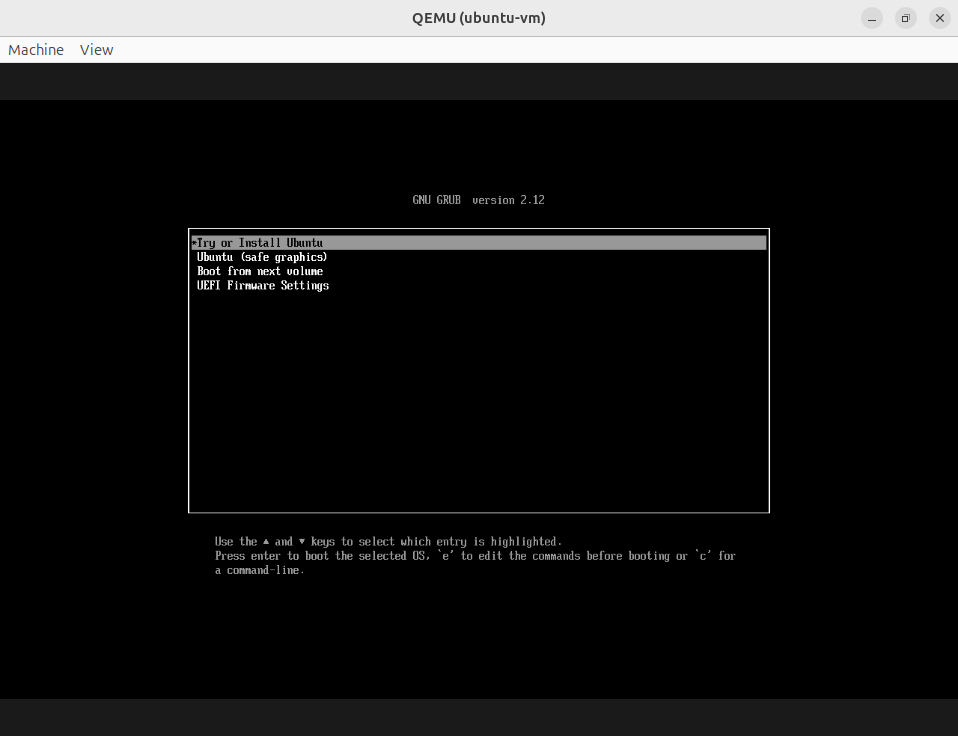

5. Run Ubuntu OS installation to install into guest image and reboot after completion.

6. Open a terminal within the guest VM.

7. Run the command shown below to upgrade Ubuntu software to the latestin the guest VM.

```bash
# Upgrade Ubuntu software
sudo apt -y update
sudo apt -y upgrade
```

> **Note:** If operating behind a corporate firewall, setup the proxy settings.

8. Copy the following files and directories from the `/home/$USER` directory of the host OS to the `/home/$USER/` directory of the guest OS:

  - *.deb kernel packages
  - sriov_patches.zip
  - ubuntu_kvm_multios_scripts.zip.
  - packages directory.
  - sriov_install directory.

```bash
# Format:
# scp -r <host_user>@<host_ip>:<host_source_dir>{file1,
# file2,
# file3,
# dir1,
# dir2} <guest_target_dir>
# where,
# <host_user>: the username of your host machine.
# <host_ip>: the IP address of your host machine.
# <host_source_dir>: source directory on the host
# <guest_target_dir>: target directory on the guest
scp -r <host_user>@<host_ip>:/home/<host_user>/{linux-
*.deb,sriov_patches.zip,ubuntu_kvm_multios_scripts.zip,packages
,sriov_install} /home/$USER
```

9. Unzip `sriov_patches.zip` and `ubuntu_kvm_multios_scripts.zip` to the `/home/$USER/` directory.

```bash
# Extract files
unzip sriov_patches.zip
unzip -jo ubuntu_kvm_multios_scripts.zip
```

10. Run `sriov_setup_kernel.sh` in the Ubuntu guest VM:

```bash
# This will install kernel and firmware, and update grub
sudo ./sriov_setup_kernel.sh
```

11. Reboot the VM:

```bash
sudo reboot
```

12. After reboot, check that the kernel is the installed version:

```bash
uname -r
6.6.50-lts2023-iotg
```

13. Run `configure_ubuntu_guest.sh` in the Ubuntu guest VM:

```bash
# This will install userspace libraries and tools
sudo ./configure_ubuntu_guest.sh
```

14. After the installation has been completed, reboot the guest when prompted.

15. Next, properly shut down the guest OS. The Ubuntu image `ubuntu.qcow2` is now ready to use.

### Running Ubuntu VM

#### Ubuntu VM Running Prerequisites

##### Ubuntu Guest VM Launch Scripts

On the Ubuntu host download the launch script `ubuntu_kvm_multios_scripts.zip` from the release package [RPL-S_RPL-SR_KVM_MultiOS.zip](https://www.intel.com/content/www/us/en/secure/design/confidential/software-kits/kit-details.html?kitId=839117)

> **Note:** If you have performed the Host kernel setup, the ZIP files and all the scriptfiles should already be in the system.

#### Launching Ubuntu Guest VM

```bash
# Change directory
cd /home/$USER
# Launch the Ubuntu Guest VM
sudo -E ./start_ubuntu.sh
```

#### Launching Multiple Ubuntu Guest VMs

1. Create multiple copies of OVMF files:

```bash
cd /home/$USER
cp ./ovmf/OVMF_VARS.fd ./OVMF_VARS_ubuntu.fd
cp OVMF_VARS_ubuntu.fd OVMF_VARS_ubuntu2.fd
cp OVMF_VARS_ubuntu.fd OVMF_VARS_ubuntu3.fd
cp OVMF_VARS_ubuntu.fd OVMF_VARS_ubuntu4.fd
```

2. Follow the steps in the section [Creating Ubuntu VM Image](#creating-ubuntu-vm-image) to create and setup the Ubuntu guest images. Make sure that the images are named as `ubuntu.qcow2`, `ubuntu2.qcow2`, `ubuntu3.qcow2` and `ubuntu4.qcow2`.

3. Create a `start_all_ubuntu.sh` script to launch multiple guests:

> **Note:** The amount of memory and cores allocated might be different for each platform.

```bash
#!/bin/bash
# Sample script to launch multiple Ubuntu guests
# Remember to customise the launch commands according to HW
setup and use case:
# - number of guests
# - memory allocated
# - core allocated
# Propagate signal to children
trap 'trap " " SIGTERM; kill 0; wait' SIGINT SIGTERM
# Start Ubuntu multi guests
echo "Starting Ubuntu Guest1..."
sudo ./start_ubuntu.sh -m 2G -c 2 -n ubuntu-vm1 &
echo "Starting Ubuntu Guest2..."
sudo ./start_ubuntu.sh -m 2G -c 2 -n ubuntu-vm2 -f
OVMF_VARS_ubuntu2.fd -d ubuntu2.qcow2 -p ssh=2223 &
echo "Starting Ubuntu Guest3..."
sudo ./start_ubuntu.sh -m 2G -c 2 -n ubuntu-vm3 -f
OVMF_VARS_ubuntu3.fd -d ubuntu3.qcow2 -p ssh=2224 &
echo "Starting Ubuntu Guest4..."
sudo ./start_ubuntu.sh -m 2G -c 2 -n ubuntu-vm4 -f
OVMF_VARS_ubuntu4.fd -d ubuntu4.qcow2 -p ssh=2225 &
wait
```

4. Launch all the guest VMs with the command below:

```bash
# Launch all the guest VMs
chmod +x ./start_all_ubuntu.sh
./start_all_ubuntu.sh
```

#### Ubuntu Configuration Options

##### Changing Ubuntu Guest VM Memory and Number of CPUs

The default launch command without any parameters is for 2 cores and 2G RAM. You can change that with startup parameters.

Example guest start configuration for 4 cores, 4G RAM:

```bash
# Add -m option to specify 4G of memory
# Add -c option to specify 4 cpu cores for guest VM
sudo -E ./start_ubuntu.sh -m 4G -c 4
```

##### Enabling USB Devices in Guest VM

For Ubuntu guest VMs, USB devices can be setup in two ways:

1. Passthrough of All USB Host Devices

USB host passthrough parameter option can be added in the launch command to passthrough all USB devices on the USB host.

Add an additional parameter to the Guest VM launch command:

```bash
# Note: all connected USB devices will be passthrough to the
guest VM with USB host passthrough option
sudo -E ./start_ubuntu.sh --passthrough-pci-usb
```

2. Passthrough of Selected USB Devices

An external command option can be used to passthrough only a few selected USB devices.

Retrieve the vendorid and productid of USB device. In this example, ‘046d’ is vendor
ID, ‘c06a’ is product ID.

```bash
# On target terminal.
lsusb
Bus 004 Device 003: ID 046d:c06a Logitech, Inc. USB Optical
Mouse
```

Add an additonal parameter to the Guest VM launch command:

```bash
# Add extra command when start guest
sudo -E ./start_ubuntu.sh -e "-device usb-host,vendorid=0x046d,productid=0xc06a"
```

> **Note:** A passthrough device option can only be used once because a device can be passthrough to only 1 guest VM at a time.

##### Enabling PCIe Wi-Fi Adapter Device in Guest VM

For Ubuntu guest VMs, PCI Wi-Fi device passthrough can be setup by adding `--passthrough-pci-wifi` parameter to guest VM launch command:

```bash
# Add --passthrough-pci-wifi for passing through Wifi adapter
sudo -E ./start_ubuntu.sh --passthrough-pci-wifi
```