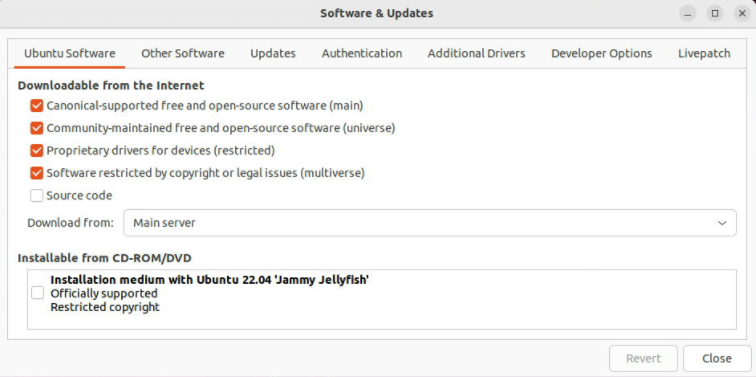

# Kernel and Host User Space Setup

Follow the steps below to generate the necessary kernel and userspace files to set up a Ubuntu 22.04 hypervisor for hosting guest VMs.

> **Note:** a Ubuntu host with SRIOV running on a supported Intel Core platform with iGPU (RPL) is required in order to run Windows VM installation for SR-IOV.

Build steps can performed either on a Ubuntu 22.04 host or Ubuntu 22.04 docker container on Ubuntu host.

## Required Host BIOS Settings

| | | |
|---|---|---|
|Intel (VMX) Virtualization|Intel Advanced Menu -> CPU Configuration|Enabled|
|VT-d|Intel Advanced Menu -> System Agent (SA) Configuration|Enabled|
|SRIOV Enable|Intel Advanced Menu -> System Agent (SA) Configuration -> Graphics Configuration|Enabled|
|Intel(R) TCC Mode|Intel Advanced Menu -> Intel(R) Time Coordinated Computing|Disabled|
|#AC Split Lock|Intel Advanced Menu -> Intel(R) Time Coordinated Computing|Disabled|
|Attemp Secure Boot|Boot Maintenance Manager Menu -> Secure Boot Configuration Menu|Disabled|

> **Note:** ***BIOS menu can vary depending on the release.***

## Install Ubuntu host

1. Download [Ubuntu 22.04 (Jammy Jellyfish) Intel IOT iso](https://cdimage.ubuntu.com/releases/jammy/release/inteliot/ubuntu-22.04-desktop-amd64+intel-iot.iso)

2. Install Ubuntu 22.04 (Jammy Jellyfish):

   ```bash
   # Copy the iso file into a USB drive
   $ sudo dd if=./ubuntu-22.04-desktop-amd64+intel-iot.iso of=/dev/sdX bs=4M && sync

   # Check the boot order number X of the USB drive
   $ sudo efibootmgr

   # Select the USB drive as the next boot device
   $ sudo efibootmgr -n X

   # Reboot into the drive to start the installation
   $ sudo reboot
   ```

> **Note:** If operating behind a corporate firewall, setup proxy settings as required.

3. In "Software & Updates" GUI, make sure you're set to download from **Main server**, as shown below:



4. Upgrade Ubuntu host software to the latest version:

   ```bash
   # Upgrade Ubuntu software
   # Generic host kernel installed from Ubuntu may be incompatible with board
   # Therefore after upgrade, continue to install host kernel and firmware before rebooting
   $ sudo apt -y update
   $ sudo apt -y upgrade
   ```

## Setup IOTG kernel on Ubuntu Host

### Kernel Setup prerequisites

1. MultiOS virtualization [scripts](https://github.com/intel-innersource/virtualization.multios.kvm.scripts/archive/refs/tags/rpls_sriov_kvm_multios_emt-3.1_ww2525.zip)

2. **kernel-config-6_12.zip** (found inside the above package)

### Build IOTG Kernel

1. Create a working directory:

   ```bash
   # Create a working directory
   $ mkdir <work directory>
   $ cd <work directory>
   ```
2. Extract files

   ```bash
   # Extract files
   $ unzip -jo virtualization.multios.kvm.scripts-rpls_sriov_kvm_multios_emt-3.1_ww2525.zip
   $ unzip -jo kernel-config-6_12.zip
   ```

3. Build Kernel debian files and package them:

   ```bash
   # build kernel debs
   $ ./sriov_prepare_kernel.sh

   # package deb files
   $ cd sriov_build
   $ find . -name "*.deb"
   ./linux-headers-6.12.xx-lts2024-iotg_xxxx_amd64.deb
   ./linux-image-6.12.xx-lts2024-iotg-dbg_amd64.deb
   ./linux-image-6.12.xx-lts2024-iotg_xxxx_amd64.deb
   ./linux-libc-dev_6.12.xx-xxxx_amd64.deb
   ```

4. Create **lts2024-iotg-kernel-rel.tar.gz** package and copy it to the working directory:

   ```bash
   # Create lts2024-iotg-kernel-rel.tar.gz
   $ tar czvf lts2024-iotg-kernel-rel.tar.gz *.deb

   # copy to working dir
   $ cd -
   $ cp sriov_build/lts2024-iotg-kernel-rel.tar.gz .
   ```

### Install IOTG host kernel on Ubuntu SR-IOV host

1. Boot into Ubuntu Host OS go to the work directory"

   ```bash
   # Change to work directory
   $ cd ~
   ```

2. Copy source files:

   ```bash
   # Copy files
   $ cp <source path>/lts2024-iotg-kernel-rel.tar.gz .
   $ cp <source path>/virtualization.multios.kvm.scripts-rpls_sriov_kvm_multios_emt-3.1_ww2525.zip .
   ```

3. Extract the script files:

   ```bash
   # Extract script files
   $ unzip -jo virtualization.multios.kvm.scripts-rpls_sriov_kvm_multios_emt-3.1_ww2525.zip
   ```

4. Perform Kernel Setup and Reboot Ubuntu Host:

   ```bash
   # Perform kernel setup
   # This will install kernel and firmware, and update grub
   $ sudo ./sriov_setup_kernel.sh

   # Reboot Ubuntu host
   $ sudo reboot
   ```

### Setup Ubuntu host for SR-IOV usage

1. Boot into the Ubuntu Host OS and navigate to work directory:

   ```bash
   # Change to work directory
   $ cd ~
   ```

2. Extract files from `sriov_patches.zip` (found inside `virtualization.multios.kvm.scripts-rpls_sriov_kvm_multios_emt-3.1_ww2525.zip`)

   ```bash
   # Extract files
   $ $ unzip sriov_patches.zip
   ```

3. Update the host with extracted patches, and reboot the host:

   ```bash
   # Update the host
   $ sudo ./sriov_setup_ubuntu.sh

   # Reboot the host
   $ sudo reboot
   ```

   > **Note:** If you need to run any reliability or benchmark test on the host, please run the following commands to disable auto suspend and hibernation:

   ```bash
   # disable suspend and hibernate service
   $ sudo systemctl mask sleep.target suspend.target hibernate.target hybrid-sleep.target
   # reboot Ubuntu host
   $ sudo reboot now
   ```

### OPTIONAL: Generate guest VM installation files

You can generate guest VM installation files by either running an initial full setup on a  Ubuntu 22.04 host with SR-IOV installed, or by generating the files in an Ubuntu 22.04 docker container.

#### Option 1: Initial full setup of Ubuntu 22.04 SRIOV host

Follow the steps in the earlier sections to perform a full initial setup on the first host OS.
If you have completed [Install IOTG host kernel on Ubuntu SR-IOV host](#install-iotg-host-kernel-on-ubuntu-sr-iov-host) and [Setup Ubuntu host for SR-IOV usage](#setup-ubuntu-host-for-sr-iov-usage), you should have two directories containing the install files:

- `packages`
- `sriov_install`

Copy these directories to use in future setups on second or subsequent hosts.

```bash
# Copy out the directories containing the install files
$ cp -r packages <target path>
$ cp -r sriov_install <target path>
```

#### Option 2: Ubuntu 22.04 docker

Alternatively, the install files can be generated by performing the following steps in an Ubuntu docker container:

```bash
# Update and upgrade Ubuntu docker container
sudo apt update
sudo apt upgrade

# Copy the script files
$ cp <source path>/virtualization.multios.kvm.scripts-rpls_sriov_kvm_multios_emt-3.1_ww2525.zip .

# Extract files
$ unzip -jo virtualization.multios.kvm.scripts-rpls_sriov_kvm_multios_emt-3.1_ww2525.zip
$ unzip sriov_patches.zip

# Prepare and create install files
sudo ./sriov_prepare_projects.sh
sudo ./sriov_install_projects.sh

# Copy out the directories containing the install files
cp -r packages <target path>
cp -r sriov_install <target path>
```
