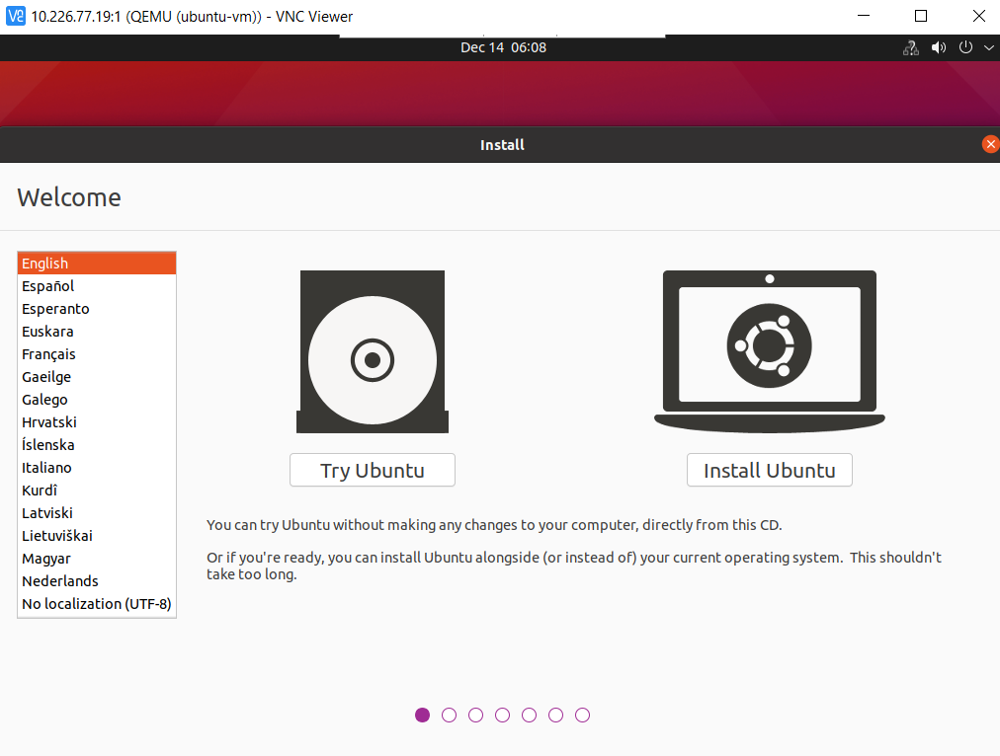
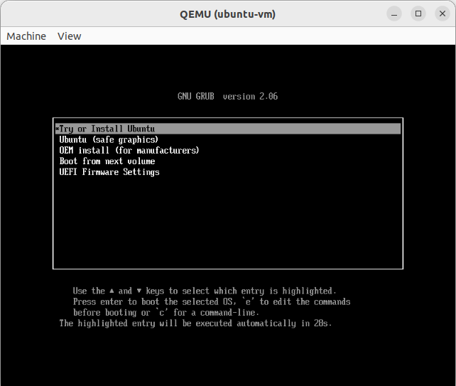

# Create Ubuntu Guest VM under Ubuntu Host

## Install and Setup Ubuntu VM

### Prerequisites

1. Installation scripts

   Download the required installation scripts from the release package
   `RPL-S_RPL-SR_KVM_MultiOS.zip`, obtained from Your Intel Representative.

   Run the following

   ```bash
   # Change to work directory
   cd ~

   # Copy files
   cp <source path>/virtualization.multios.kvm.scripts-rpls_sriov_kvm_multios_emt-3.1_ww2525.zip .

   # Extract script files
   unzip -jo virtualization.multios.kvm.scripts-rpls_sriov_kvm_multios_emt-3.1_ww2525.zip
   ```

2. Ubuntu ISO image

   Download [Ubuntu 24.04.2 LTS image](https://cdimage.ubuntu.com/releases/jammy/release/inteliot/ubuntu-22.04-desktop-amd64+intel-iot.iso)


#### Prepare Ubuntu VM image

1. Create a symlink.

   ```bash
   ln -s ubuntu-22.04-desktop-amd64+intel-iot.iso ubuntu.iso
   ```

2. Create an empty Ubuntu image file.

   ```bash
   cd /home/$USER/
   qemu-img create -f qcow2 ubuntu.qcow2 64G
   ```

3. Prepare OVMF files.

   ```bash
   cd /home/$USER/
   ln -sf ovmf/OVMF_CODE.fd OVMF_CODE.fd
   cp ovmf/OVMF_VARS.fd OVMF_VARS_ubuntu.fd
   ```

4. Create a separate copy of OVMF for Ubuntu VM use:

   ```bash
   # Make a copy of OVMF for Ubuntu guest
   ln -sf ovmf/OVMF_CODE.fd OVMF_CODE.fd
   cp ovmf/OVMF_VARS.fd OVMF_VARS_ubuntu.fd
   ```

#### Install Ubuntu VM Image

1. Run `install_ubuntu.sh` to start Ubuntu guest VM installation.

   ```bash
   # Start guest VM to install Ubuntu
   sudo ./install_ubuntu.sh
   ```

   > **Note:** If guest VM enters UEFI shell instead of Ubuntu, please type the
   > following in the EFI shell:

   ```bash
   fs0:
   cd efi/boot
   grubx64.efi
   ```

   Then, press the enter key and continue booting to Ubuntu, as shown below.

   

2. Install Ubuntu for the guest OS.

   

   > **Note:** At the end of Ubuntu installation, the installer will ask you to
   > remove the installation disk. Just press 'Enter' to reboot to the newly
   > installed Ubuntu guest OS.

### Configure Ubuntu Guest VM

1. Open a terminal within the Ubuntu guest VM.

2. Run the command shown below to upgrade Ubuntu software.

   ```bash
   # Upgrade Ubuntu software
   sudo apt -y update
   sudo apt -y upgrade
   ```

   > **Note:** If operating behind a corporate firewall, setup proxy settings as required.

3. Install custom intel kernel and configure the Ubuntu guest OS.

   Copy the following files and directories from the `/home/$USER` directory of
   the host OS to the `/home/$USER/` directory of the guest OS:

   - lts2024-iotg-kernel-rel.tar.gz
   - the `packages` directory
   - the `sriov_install` directory

   Boot into the Ubuntu guest image:

   ```bash
   # Change to work directory
   cd ~

   # Copy install files from host into /home/$USER
   # Format:
   # scp -r <host_user>@<host_ip>:<host_source_dir>{file1,
   # file2,
   # file3,
   # dir1,
   # dir2} <guest_target_dir>
   # where,
   # <host_user>: the username of your host machine.
   # <host_ip>: the IP address of your host machine.
   # <host_source_dir>: source directory on the host
   # <guest_target_dir>: target directory on the guest
   scp -r <host_user>@<host_ip>:/home/<host_user>/{lts2024-iotg-kernel-rel.tar.gz,virtualization.multios.kvm.scripts-rpls_sriov_kvm_multios_emt-3.1_ww2525.zip,packages,sriov_install} /home/$USER

   # Extract script files
   unzip -jo virtualization.multios.kvm.scripts-rpls_sriov_kvm_multios_emt-3.1_ww2525.zip
   unzip sriov_patches.zip

   # Perform kernel setup
   # This will install kernel and firmware, and update grub
   sudo ./sriov_setup_kernel.sh

   # Reboot the guest
   sudo reboot
   ```

9. Reboot into the guest:

   ```bash
   # after reboot check the kernel version
   uname -r
   6.12.32-lts2024-iotg

   # Update and configure the guest
   sudo ./configure_ubuntu_guest.sh
   ```

   > **IMPORTANT:** Please shutdown the guest properly once the installation
   is completed!

   The ubuntu.qcow2 image is now ready to use.

## Configuration Options for Running Ubuntu VM

### Changing Guest VM Memory and Number of CPUs

The default launch command without any parameters is for 2 cores and 2G RAM.
You can change that with startup parameters.

Below is an example of guest start configuration for 4 cores and 4GB of RAM:

```bash
# Add -m option to specify 4G of memory
# Add -c option to specify 4 cpu cores for guest VM
sudo -E ./start_ubuntu.sh -m 4G -c 4
```

### Enabling USB Devices in Guest VM

For Ubuntu guest VMs, USB devices can be setup in two ways:

1. Passthrough of all USB host devices.

   USB host passthrough parameter option can be added in the launch command
   to passthrough all USB devices on the USB host.

   Add an additional parameter to the Guest VM launch command:

   ```bash
   # Note: all connected USB devices will be passthrough to the
   guest VM with USB host passthrough option
   sudo -E ./start_ubuntu.sh --passthrough-pci-usb
   ```

2. Passthrough of selected USB devices.

   An external command option can be used to passthrough only a few selected USB devices.

   Retrieve the vendorid and productid of USB device. In this example, `046d` is vendor
   ID, `c06a` is product ID.

   ```bash
   # On target terminal.
   lsusb
   Bus 004 Device 003: ID 046d:c06a Logitech, Inc. USB Optical
   Mouse
   ```

   Add an additonal parameter to the Guest VM launch command:

   ```bash
   # Add extra command when start guest
   sudo -E ./start_ubuntu.sh -e "-device usb-host,vendorid=0x046d,productid=0xc06a"
   ```

> **Note:** A passthrough device option can only be used once because a device
> can be passed through to only 1 guest VM at a time.

### Enabling PCIe Wi-Fi Adapter Device in Guest VM

For Ubuntu guest VMs, PCI Wi-Fi device passthrough can be setup by adding
`--passthrough-pci-wifi` parameter to guest VM launch command:

```bash
# Add --passthrough-pci-wifi for passing through Wifi adapter
sudo -E ./start_ubuntu.sh --passthrough-pci-wifi
```