# Create Windows 11 Guest VM under Ubuntu Host

## Install and Setup Windows 11 VM

### Prerequisites

1. Installation Script

   If you already have installed the required `rpls_sriov_kvm_multios_emt-3.1_ww2525.zip` script as part of the host setup, skip this step. Otherwise, download the installation script from a source provided by Your Intel Representative.

   Unzip and install it on the host OS:

   ```bash
   unzip -jo rpls_sriov_kvm_multios_emt-3.1_ww2525.zip
   ```

2. Windows ISO Image

   Download [Windows 11 Enterprise version 24H2](https://www.microsoft.com/en-us/software-download/windows11) into your working
   directory, where you unzipped the installation scripts and ran the host setup.
   For purpose of this guide we're assuming this directory to be `/home/$USER`.

### Prepare Windows VM Image

1. Create a symlink.

   ```bash
   # Windows 11
   ln -s 26100.1.240331-1435.ge_release_CLIENTENTERPRISE_OEM_x64FRE_en-us.iso windows.iso
   ```

2. Create an empty Windows image file:

   ```bash
   cd /home/$USER/
   qemu-img create -f qcow2 win.qcow2 64G
   ```

3. Prepare OVMF files:

   ```bash
   ln -sf ovmf/OVMF_CODE.fd OVMF_CODE.fd
   cp ovmf/OVMF_VARS.fd OVMF_VARS_windows.fd
   ```

### Install Windows VM Image

1. Run `install_windows.sh` to install the Windows guest OS.

   ```bash
   # Start guest VM to install Windows
   cd /home/$USER/
   sudo ./install_windows.sh
   ```

   > **Note:** If you miss the “Press Any Key” message, press ESC key until you
   > reach the EFI shell prompt, then type “reset” to start over again.
   > Then, follow the Windows installation steps.

2. Select **Install Windows 11** and click **Next**:

   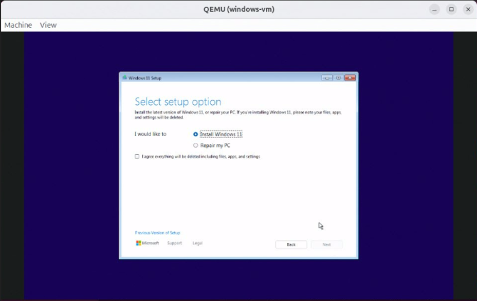

3. Select **Windows 11 IoT Enterprise**":

   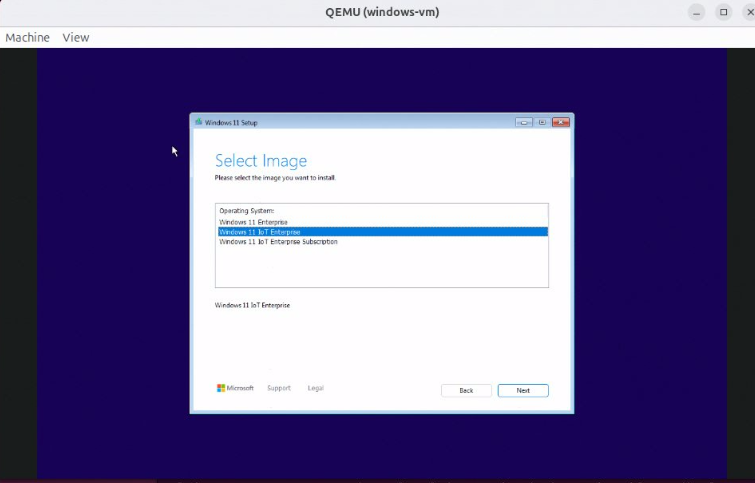

4. Select **Drive 0 Unallocated Space** and click **Next**:

   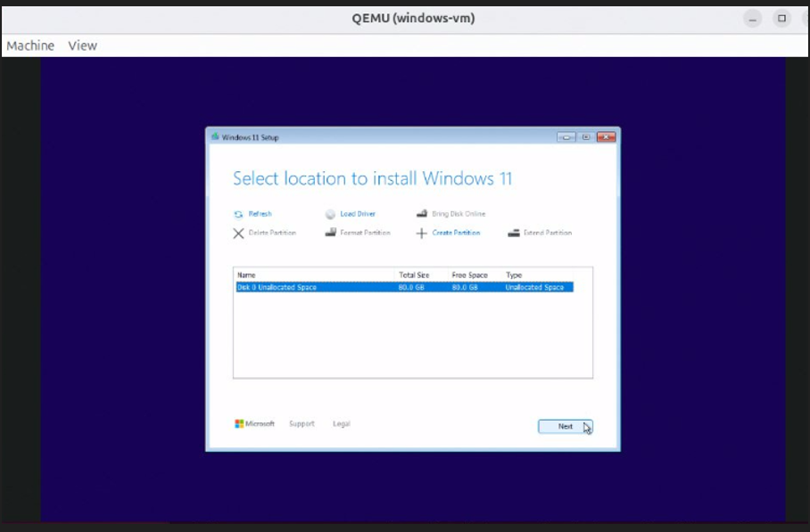

5. Select **Ready to install**:

   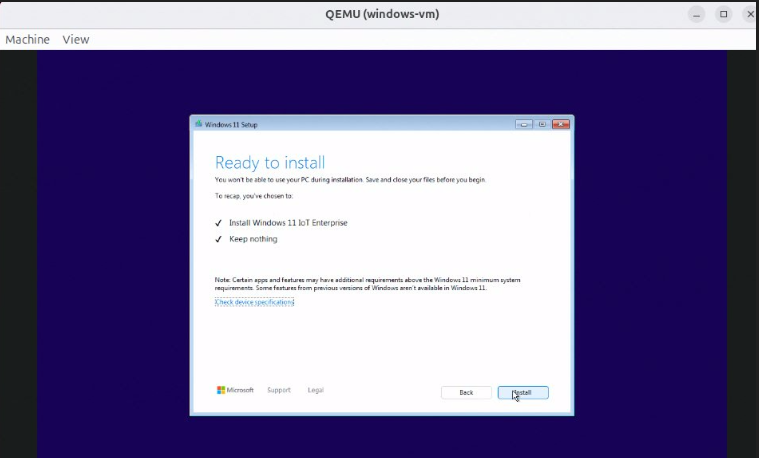

6. Follow the Windows installation steps as usual, rebooting as necessary.
   When the installer asks for a network connection, select **I don't have internet**.

   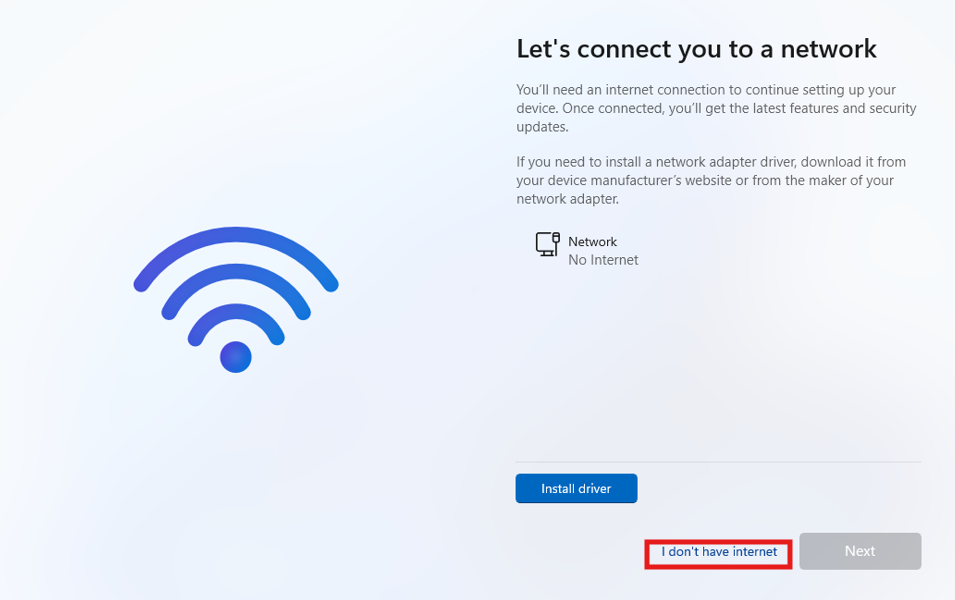

   Windows will be installed to `win.qcow2`.

7. Once the installation is done, disable the automatic updates temporarily with the
   following steps:

   - Open **Settings**.
   - Click **Updates & Security**.
   - Click **Windows Update**.
   - Click **Pause updates for 7 days**.

8. Properly shut down the Windows guest OS.

### Configure SRIOV on Windows 11 Enterprise VM

#### Required Drivers

1. [Intel Graphics UHD Iris Xe GFX driver ver. 32.0.101.6733](https://dl.dell.com/FOLDER13027935M/2/Intel-Graphics-UHD-Iris-Xe-Graphics-Driver_VFN34_WIN64_32.0.101.6733_A04.EXE)

2. [SRIOV ZeroCopy Windows driver (v1797)](https://www.intel.com/content/www/us/en/download/844242/844243/display-virtualization-drivers-for-arrow-lake-uh-arrow-lake-s.html)

3. Windows 11 OS Patch 26100.3037:
   - [KB5043080](https://catalog.sf.dl.delivery.mp.microsoft.com/filestreamingservice/files/d8b7f92b-bd35-4b4c-96e5-46ce984b31e0/public/windows11.0-kb5043080-x64_953449672073f8fb99badb4cc6d5d7849b9c83e8.msu)
   - [KB5050094](https://catalog.sf.dl.delivery.mp.microsoft.com/filestreamingservice/files/2d3f9ba9-5096-4b23-9709-3af7d7a2103f/public/windows11.0-kb5050094-x64_3d5a5f9ef20fc35cc1bd2ccb08921ee8713ce622.msu)

4. Windows VirtIO Drivers:
   - [https://fedorapeople.org/groups/virt/virtio-win/direct-downloads/latest-virtio/](https://fedorapeople.org/groups/virt/virtio-win/direct-downloads/latest-virtio/)
   - [https://fedorapeople.org/groups/virt/virtio-win/direct-downloads/archive-virtio/virtio-win-0.1.271-1/virtio-win-gt-x64.msi](https://fedorapeople.org/groups/virt/virtio-win/direct-downloads/archive-virtio/virtio-win-0.1.271-1/virtio-win-gt-x64.msi)

   > **Note:** To get access to **Intel Graphics UHD Iris Xe GFX driver ver. 32.0.101.6733**
   > and **SRIOV ZeroCopy Windows driver (v1797)**, apply for access in **Intel AGS**.
   > Remember to setup the proxy settings if operating from behind a corporate firewall.

#### Launch Windows Guest VM and Install Drivers

##### Launch Windows Guest VM

From Host OS launch Windows guest VM with `start_windows.sh`.

```bash
# Start guest VM to install Windows drivers
cd /home/$USER/
sudo ./start_windows.sh
```

##### Download and install Windows 11 OS patches in correct order

1. Double click on the **KB5043080** *.msu file to start the installation.
   After successful installation reboot the Windows Guest VM.

2. Double click on the **KB5050094** *.msu file to start the installation.
   After successful installation reboot the Windows Guest VM.

   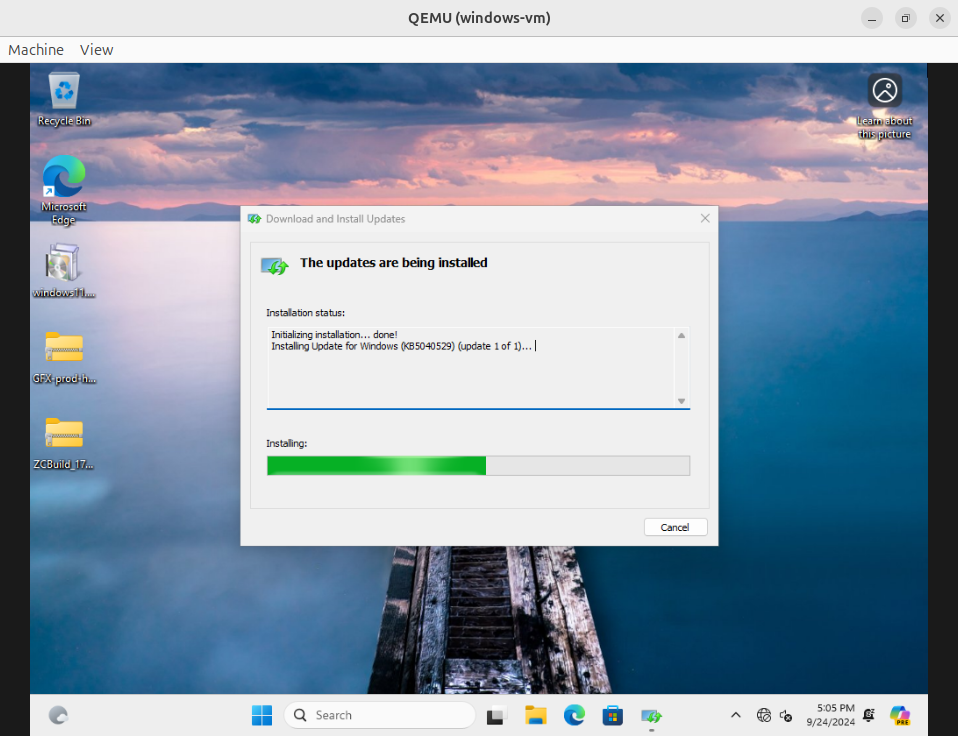

   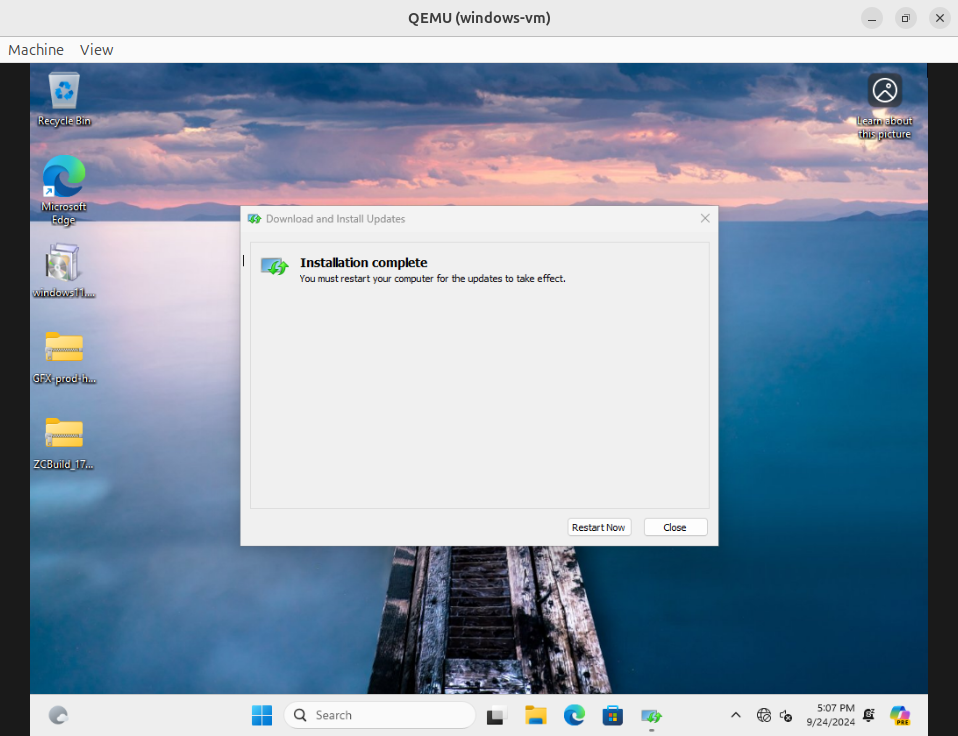

<!--3. Start Command Prompt in administrator mode and enter “winver” to check the
version. It should show 21H2 OS Builds 19044.4412.-->

##### Install GFX Driver

1. Download [Intel Graphics UHD Iris Xe GFX driver ver. 32.0.101.6733](https://dl.dell.com/FOLDER13027935M/2/Intel-Graphics-UHD-Iris-Xe-Graphics-Driver_VFN34_WIN64_32.0.101.6733_A04.EXE)

2. Use the File Explorer to navigate to the downloaded .exe file, and launch it.

3. Wait for the **Dell Update Package** window to open, then click
   **INSTALL** and follow the prompts.

   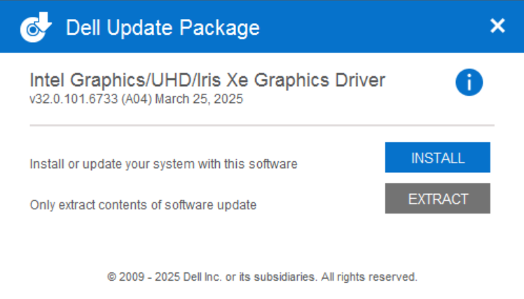

4. After intel GFX Driver installation windows opens, click the
   **Begin Installation** button:

   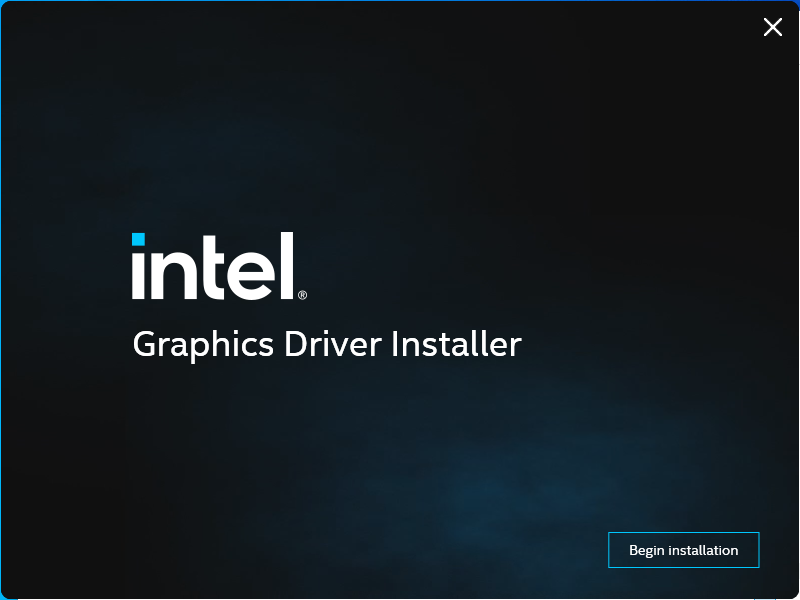

<!--2. Use File Explorer to extract the zip file.

3. Navigate into the installation folder and double click installer.exe to start it.

4. Click the "Begin Installation" button.-->

5. After the installation is completed, reboot the Windows guest VM:

   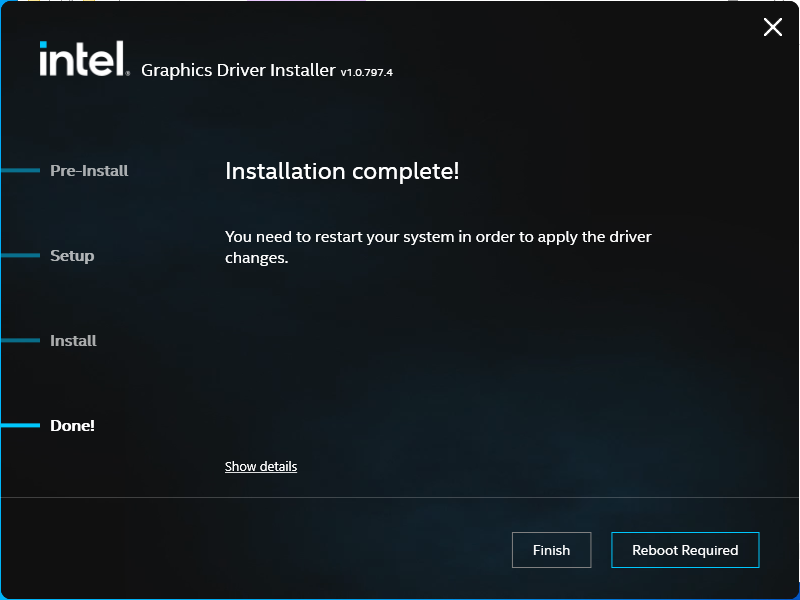

6. Launch Device Manager to verify the installation.

7. Expand the "Display adapters" item in the device list.

8. Right-click on the graphics device and select Properties. Click Drivertab.
   Verify that the Intel® Graphics version is 32.0.101.6733.

<!-- > **Note:** If you see the yellow triangle with exclamation, install the driver manually by selecting the 32.0.101.5972 version. Right-click to update the driver and select the
option to point to the main installation directory.-->

##### Install SR-IOV Zero Copy Driver

1. Download Windows Zero Copy Drivers Release 1797 [DVServer, DVServerKMD]
   [SRIOV ZeroCopy Windows driver (v1797)](https://www.intel.com/content/www/us/en/download/844242/844243/display-virtualization-drivers-for-arrow-lake-uh-arrow-lake-s.html)

   Please make sure the correct ZCBuild version is chosen from the drop-down.
   By default, the latest ZCBuild version will be the first one.

2. Use File Explorer to extract the .zip file.

   The SR-IOV Zero Copy Driver can be installed either with the GUI installer
   or through the command line.

**Install SR-IOV Zero Copy Driver Using GUI Installer**

1. Go to the directory containing **ZeroCopyInstaller**.

   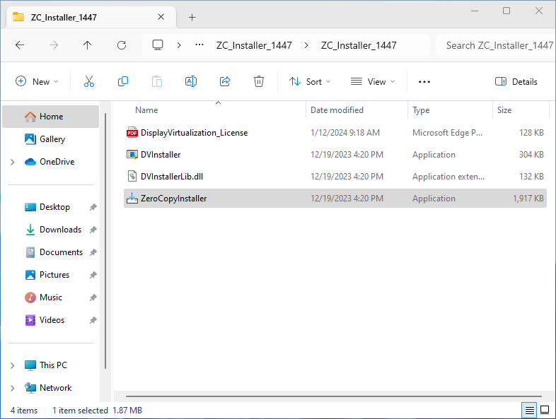

2. Double-click the **ZeroCopyInstaller** to run it.

   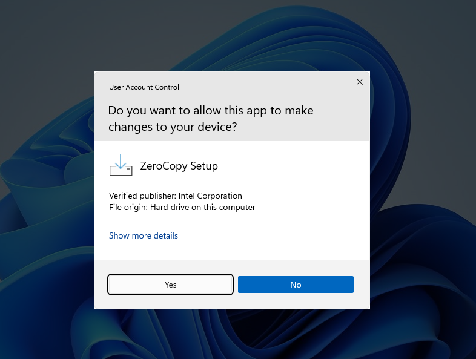

3. Click on the Install button when prompted.

   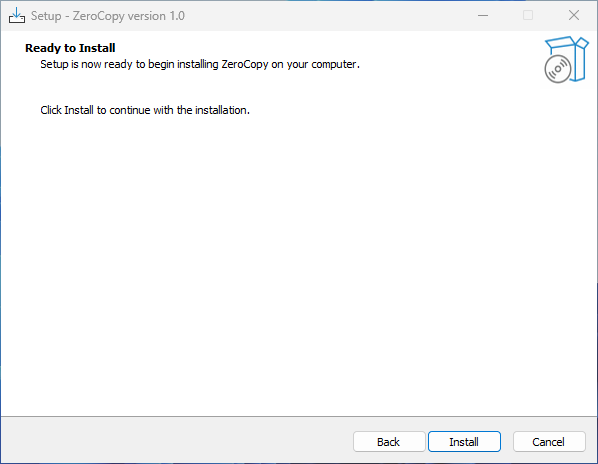

4. Once the installation is completed, click the **Finish**
   button to restart Windows.

**Install SR-IOV Zero Copy Driver Using Command Line**

1. Open Powershell in administrator mode.

2. Navigate to the directory containing **ZeroCopyInstaller**.

3. Enter the following command to perform the installation:

   ```shell
   C:\> .\ZeroCopyInstaller.exe /VERYSILENT /SUPPRESSMSGBOXES
   ```

   > **Note:** Option usage details:
   > - `/VERYSILENT` Runs silently without displaying windows
   > - `/SUPPRESSMSGBOXES` Suppresses message boxes from displaying
   > - `/NORESTART` Avoids restarting the system after installation.

4. Wait for the Windows guest to automatically restart.

**Verify SR-IOV Zero Copy Driver Installation**

1. Launch **Device Manager** to verify the installation.

2. Expand the **Display adapters** item in the device list, as shown below:

   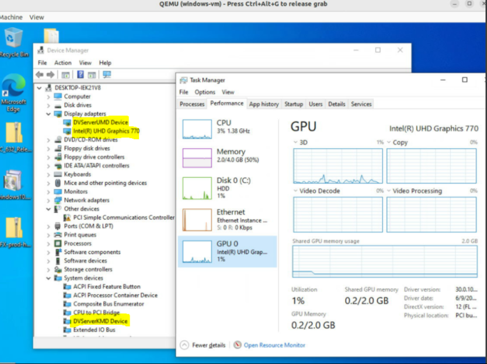

3. Verify that **DVServerUMD Device** and  **VServerKMD driver** are loaded properly.

4. In Task Manager, verify that the **GPU** tab is showing correct information.

#### Disable Graphics Driver Updates

##### Identify the Graphics Hardware ID

1. Launch the Device Manager.

2. Expand the **Display adapters** item in the device list:

   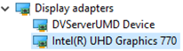

3. Right click on the graphics device and select **Properties**.

4. Switch to the **Details** tab and select **Hardware IDs** from the
   **Property** drop down list.

   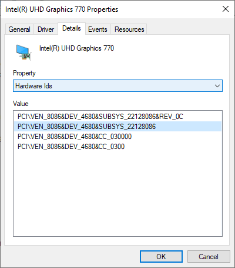

5. Right click on the second ID in the list and select **Copy** from the context menu.

##### Enable Group Policy Disabling Graphics Driver Update

1. In the Windows search bar type `gpedit.msc` and launch the Group Policy Editor.

2. On the left pane, navigate to **Computer Configuration**
   -> **Administrative Templates** -> **System** -> **Device Installation**
   -> **Device Installation Restrictions**

   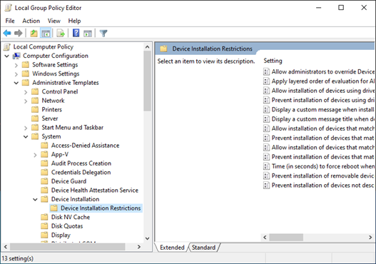

3. On the right pane, double click **Prevent installation of devices that match**
   **any of these device IDs** to display additional configuration options.

   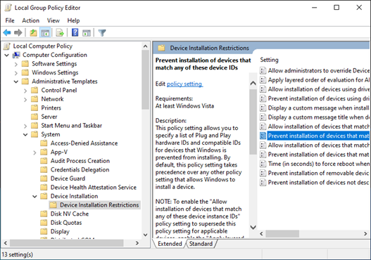

4. In the new pop-up window, click the **Enabled** radio button.

   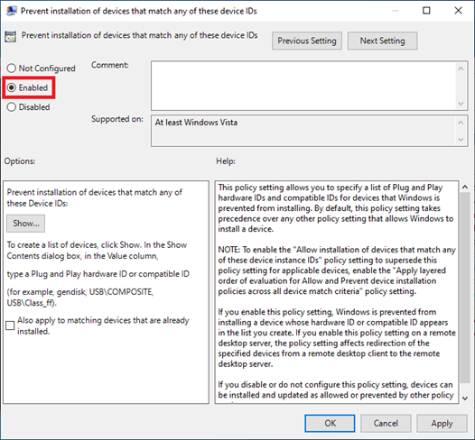

5. Clicking **Show…** will bring up a new window. Enter the device hardware
   ID copied earlier:

   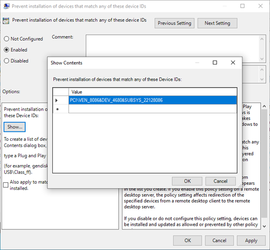

6. Click **OK** in all the dialog windows to disable graphics driver updates.

   >**Note:** To allow the graphics driver to be updated, follow the steps above,
   but select the **Disabled** radio button instead of **Enabled**.

##### Resume Windows Update

Resume the automatic Windows updates (excluding Graphics driver) with the following steps:

1. Open **Settings**.

2. Select **Update and Security**.

3. Select **Windows Update**.

4. Click the **Resume Updates** button.

#### Install Windows VirtIO Drivers

Use one of the provided [links](#required-drivers), or download the most recent
`virtio-win-gt-x64.msi or virtio-win-gt-x86.msi` from inside the VM.

Run the downloaded installer and follow the installation process.

> **IMPORTANT NOTE:** Please shutdown the guest properly once the
installation is completed!

## Configuration Options for Running Windows Guest VM

### HMI Buildtime and Runtime Customer Applications

Contact Your Intel Representative to obtain the required application.

1. Launch Windows VM

   ```bash
   # Change to work directory
   cd <work directory>

   # Launch Windows 11 guest VM
   sudo ./start_windows.sh
   ```

2. Install the HMI applications

   Download the HMI application to the host OS. In the Winodws guest VM
   use SCP to get the HMI application.

   Follow the HMI installation user guide to install and configure the License.

   > **IMPORTANT NOTE:** Please shutdown the guest properly once the
   installation is completed! The win.qcow2 image is now ready to use.

### Changing Guest VM Memory and Number of CPUs

The default launch command without any parameters is for 2 cores and 2G RAM.
You can change that with startup parameters:

Below is an example of guest start configuration for 4 cores and 4GB of RAM:

```bash
# Add -m option to specify 4G of memory
# Add -c option to specify 4 cpu cores for guest VM
sudo -E ./start_windows.sh -m 4G -c 4
```

#### Enabling USB Devices in Windows Guest VM**

For Windows guest VMs, USB devices can be setup in two ways:

1. Passthrough of all USB Host Devices

   USB host passthrough parameter option can be added in the launch command
   to passthrough all USB devices on the USB host.

   Specify an additional parameter to the Guest VM launch command as shown below.

   ```bash
   # Note: all connected USB devices will be passthrough to the
   guest VM with USB host passthrough option
   sudo -E ./start_windows.sh --passthrough-pci-usb
   ```

2. Passthrough of selected USB devices.

   An external command option can be used to passthrough only a few selected USB devices.

   Retrieve the vendorid and productid of USB device. In this example, `046d`
   is vendor ID, `c06a` is product ID.

   ```bash
   # On the target terminal.
   $ lsusb
   ```

Displays the following information:

   ```bash
   Bus 004 Device 003: ID 046d:c06a Logitech, Inc. USB Optical
   Mouse
   ```

   Specify an additional parameter to the Guest VM launch command:

   ```bash
   # Add extra command when starting the guest OS
   sudo -E ./start_windows.sh -e "-device usbhost,vendorid=0x046d,productid=0xc06a"
   ```

   > **Note:** A passthrough device option can only be used once because a device
   > can be passed through to only 1 guest VM at a time.

#### Enabling PCIe Wi-Fi Adapter Device in Windows Guest VM

For Windows guest VMs, PCI Wi-Fi device passthrough can be setup by adding
`--passthrough-pci-wifi` parameter to guest VM launch command:

```bash
# Add --passthrough-pci-wifi for passing through Wifi adapter
sudo -E ./start_windows.sh --passthrough-pci-wifi
```
