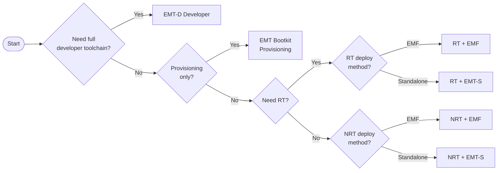

# Edge Microvisor Toolkit Editions

You can choose from several editions Edge Microvisor Toolkit to deploy
and validate workloads on Intel® platforms for various scenarios. The diagram
below will help you select the toolkit version that suits your workflow.

The table below summarizes the released versions:

| Edition | Description | Stable Kernel | [Next Kernel](../emt-architecture-overview.md#next-kernel) | Docs |
|--------|-------------|---------------|-------------|------|
| **Standalone (Immutable)** | Minimal runtime; immutable rootfs | ✓ | ✓ | [Standalone Node](https://github.com/open-edge-platform/edge-microvisor-toolkit-standalone-node) |
| **Developer Node (Mutable)** | Full toolchain, optional RT | ✓ | ✓ | [Developer Node](../emt-architecture-overview.md#developer-node-mutable-iso-image) |
| **EMT for EMF** | EMF-integrated orchestrated deployments | ✓ | ✓ | [EMT + EMF](../emt-deployment-edge-orchestrator.md) |
| **Bootkit** | Minimal iPXE provisioning image | ✓ | – | [Bootkit](./docs/developer-guide/emt-bootkit.md) |

The Edge Microvisor Toolkit has undergone extensive validation across all Intel
platforms such as  Xeon®, Intel® Core Ultra™, Intel Core™ and Intel® Atom®. It
provides robust support for integrated NPU, as well as a
[selection of discrete GPU cards](./docs/developer-guide/emt-system-requirements.md#hardware-requirements).

You can either build the Edge Microvisor Toolkit by following step-by-step
instructions or download it directly. Both the Build system and the Edge Microvisor
Toolkit are available as Open-Source.

## Next

- Learn how to [Install Edge Microvisor Toolkit](./emt-installation-howto.md).
- Learn how to customize and manually [build microvisor images](./emt-building-howto.md).
