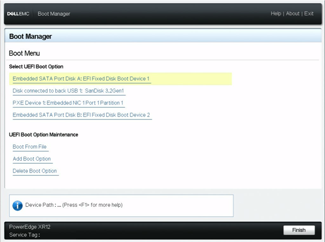

# Flash Edge Microvisor Toolkit RAW Image to Storage Device

This guide will help you flash an Edge Microvisor Toolkit RAW image to the storage device of your choice.

## Installation

1. Download the image.

   You can download the image by running the following command in the terminal:

   ```bash
   curl -k --noproxy "" https://files-rs.edgeorchestration.intel.com/files-edge-orch/repository/microvisor/non_rt/edge-readonly-3.0.20250413.2200-prod-signed.raw.gz -o edge_microvisor_toolkit.raw.gz
   
   curl -k --noproxy "" https://files-rs.edgeorchestration.intel.com/files-edge-orch/repository/microvisor/non_rt/edge-readonly-3.0.20250413.2200-prod-signed.raw.gz.sha256sum -o edge_microvisor_toolkit.raw.gz.sha256sum
   ```

2. Unpack the RAW image:

   Run:

   ```bash
   gzip -d edge_microvisor_toolkit.raw.gz
   chmod -Rf 777 edge_microvisor_toolkit.raw
   ```

3. Flash the RAW image to a different, available storage device using the 'dd' command

   Run:

   ```bash
   sudo dd if=edge_microvisor_toolkit.raw of=/dev/sdc status=progress
   ```

   > **Note:** Successful flashing of the image should produce partitions such as /dev/sdb and /dev/sdc

   

## Configuring Edge Node

1. Configure the server to reboot with required disk/OS/partition

   Using the CLI method:

   Run `sudo efibootmgr`:

   ```bash
   BootCurrent: 0002
   BootOrder: 0002,0012,0014,0015
   Boot0002* ubuntu
   Boot0012  EFI Fixed Disk Boot Device 2
   Boot0014  Cruzer Blade
   Boot0015  NIC in Slot 2 Port 2 Partition 1
   MirroredPercentageAbove4G: 0.00
   MirrorMemoryBelow4GB: false
   ```

   Find the ID of EMT boot device and run `sudo efibootmgr -o <ID of EMT boot device>`. Then run `sudo reboot`

   You can also reboot and go to the boot manager to select the flashed partition:

   

2. Check date

   Run `sudo date080509312024`.

   The string of numbers after `date` is the date in time in the following format: Month:08 Day:05 Hour:09 Minute:31 Year: 2024

3. Install openssh-server package

   Run `tdnf install openssh-server`.

4. Install vim package

   Run `tdnf install vim`.

5. Configure and enable ssh

   Run:

   ```bash
   echo "PermitRootLogin yes" >> /etc/ssh/sshd_config
   echo "PasswordAuthentication yes" >> /etc/ssh/sshd_config
   ```

6. Restart sshd service to apply changes

   Run `sudo systemctl restart sshd`.

   > **Note**: If you want to use the bootable storage device for other purposes, you can [allocate the remaining storage space to one of the partitions](./emt-flashing-raw-partition-resize.md)

## Troubleshooting (Best Known Methods)

- **BIOS Security Settings**

   Disable the Secure Boot option in BIOS Settings if it was enabled.

- **Network is not working in XR12 (with x710 NIC)**

1. Install the drivers manually:

   ```bash
   modprobe i40e
   ```

2. Install vim tool to edit the ssh config file:

   ```bash
   tdnf install vim
   ```

3. Install and Configure the SSH server:

   ```bash
   tdnf install openssh-server
   ```

4. Update the ssh configuration to ssh with the following information:

   ```bash
   vi /etc/ssh/sshd_config

   PermitRootLogin yes

   PasswordAuthentication yes
   ```

5. Restart sshd service:

   ```bash
   systemctl restart sshd
   ```

   To debug, run only:

   ```bash
   journalctl -u sshd -f
   ```

- **Switching between multiple OS disks**

1. Install and configure efibootmgr. Run `tdnf install efibootmgr`:

   ```bash
   BootCurrent: 0000
   BootOrder: 0000,0005,0006,0002
   Boot0000* EFI Fixed Disk Boot Device 2
   Boot0002* ubuntu
   Boot0005* Cruzer Blade
   Boot0006* NIC in Slot 2 Port 2 Partition 1
   MirroredPercentageAbove4G: 0.00
   MirrorMemoryBelow4GB: false
   ```

2. Select the boot device with the desired OS and run `efibootmgr -o <ID of boot device>`

3. Reboot to change the OS to boot

   ```bash
   reboot
   ```

