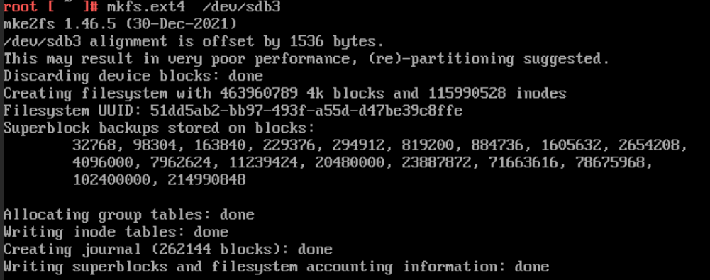

# Changing Partition Size in Edge Microvisor Toolkit

Follow these steps to modify the partition sizes in order to use the remaining free space on your bootable medium.

## Install required tools

Run `tdnf install -y cloud-utils-growpart parted`

```bash
tdnf install -y cloud-utils-growpart parted
Loaded plugin: tdnfrepogpgcheck
Package cloud-utils-growpart is already installed.
Package parted is already installed.
Nothing to do.
```

## Delete /data partition /dev/sdb3 or /data

Run `parted /dev/sdb`:

```bash
parted /dev/sdb
GNU Parted 3.4
Using /dev/sdb
Welcome to GNU Parted! Type 'help' to view a list of commands.
```

Run `p`:

```bash
p
Model: ATA MTFDDAK1T9TDS (scsi)
Disk /dev/sdb: 1920GB
Sector size (logical/physical): 512B/4096B
Partition Table: gpt
Disk Flags:

Number  Start   End     Size    File system  Name     Flags
 1      1049kB  419MB   418MB   fat16        esp      boot, esp
 2      419MB   10.0GB  9581MB  ext4         rootfs
 3      10.0GB  1920GB  1910GB  ext4         primary
```

Run `rm 3`:


```bash
rm 3
Warning: Partition /dev/sdb3 is being used. Are you sure you want to continue?
Yes/No?
```

Select `Yes`:

```bash
Yes
Error: Partition(s) 3 on /dev/sdb have been written, but we have been unable to
inform the kernel of the change, probably because it/they are in use.  As a
result, the old partition(s) will remain in use.  You should reboot now before
making further changes.
Ignore/Cancel?
```

Select `Ignore` and then `quit`:

```bash
Ignore
(parted) quit
quit
Information: You may need to update /etc/fstab.
```

## Inform Kernel about the change

Run `partprobe`:

```bash
partprobe
Error: Partition(s) 3 on /dev/sdb have been written, but we have been unable to inform the kernel of the change, probably because it/they are in use.  As a result, the old partition(s) will remain in use.  You should reboot now before making further changes.
Warning: Not all of the space available to /dev/sdc appears to be used, you can fix the GPT to use all of the space (an extra 22075392 blocks) or continue with the current setting?
```

## Check the partition sizes

Run `lsblk`

## Resize partion /dev/sdb2 to 20GB**

Run `parted /dev/sdb`:

```bash
parted /dev/sdb
GNU Parted 3.4
Using /dev/sdb
Welcome to GNU Parted! Type 'help' to view a list of commands.
(parted)
```

Select `p`

Result:

```bash
Model: ATA MTFDDAK1T9TDS (scsi)
Disk /dev/sdb: 1920GB
Sector size (logical/physical): 512B/4096B
Partition Table: gpt
Disk Flags:

Number  Start   End     Size    File system  Name    Flags
 1      1049kB  419MB   418MB   fat16        esp     boot, esp
 2      419MB   10.0GB  9581MB  ext4         rootfs
```

Run `resizepart 2 20GB`

```bash
resizepart 2 20GB
Warning: Partition /dev/sdb2 is being used. Are you sure you want to continue?
Yes/No?
```
Select `yes`.

```bash
yes
Error: Error informing the kernel about modifications to partition /dev/sdb2 --
Device or resource busy.  This means Linux won't know about any changes you made
to /dev/sdb2 until you reboot -- so you shouldn't mount it or use it in any way
before rebooting.
Ignore/Cancel?
```

Select `Ignore`:

```bash
Ignore
Error: Partition(s) 3 on /dev/sdb have been written, but we have been unable to
inform the kernel of the change, probably because it/they are in use.  As a
result, the old partition(s) will remain in use.  You should reboot now before
making further changes.
Ignore/Cancel?
```

Select `Ignore` and run `p`:

```bash
p
Model: ATA MTFDDAK1T9TDS (scsi)
Disk /dev/sdb: 1920GB
Sector size (logical/physical): 512B/4096B
Partition Table: gpt
Disk Flags:

Number  Start   End     Size    File system  Name    Flags
 1      1049kB  419MB   418MB   fat16        esp     boot, esp
 2      419MB   20.0GB  19.6GB  ext4         rootfs
 ```


### Check the partition size in Kernel

Run `lsblk /dev/sdb`

```bash
lsblk /dev/sdb
NAME   MAJ:MIN RM  SIZE RO TYPE MOUNTPOINTS
sdb      8:16   0  1.7T  0 disk
|-sdb1   8:17   0  399M  0 part /boot/efi
|-sdb2   8:18   0  8.9G  0 part /
`-sdb3   8:19   0  1.7T  0 part /data
```

### Update kernel on size change

Run `sgdisk  -e /dev/sdb`:

```bash
sgdisk  -e /dev/sdb
Warning: The kernel is still using the old partition table.
The new table will be used at the next reboot or after you
run partprobe(8) or kpartx(8)
The operation has completed successfully.
```

Run `partprobe`.

### Make a backup of /etc/fstab

Run `cp /etc/fstab /root/fstab-backup`.

### Delete the /dev/sdb3 line from /etc/fstab

Run `vi /etc/fstab`.

### Reboot to see the updated partitions

`reboot`

### Check the partition sizes after boot

Run `lsblk`


```bash
lsblk
NAME                      MAJ:MIN RM  SIZE RO TYPE MOUNTPOINTS
sda                         8:0    0  1.7T  0 disk
|-sda1                      8:1    0    1G  0 part
|-sda2                      8:2    0    2G  0 part
`-sda3                      8:3    0  1.7T  0 part
  `-ubuntu--vg-ubuntu--lv 254:0    0  100G  0 lvm
sdb                         8:16   0  1.7T  0 disk
|-sdb1                      8:17   0  399M  0 part /boot/efi
`-sdb2                      8:18   0 18.2G  0 part /
sdc                         8:32   1 14.5G  0 disk
|-sdc1                      8:33   1    8M  0 part
`-sdc2                      8:34   1    4G  0 part
```

### Create /dev/sdb3 partition again with 100% remaining space

Run `parted /dev/sdb`

```bash
parted /dev/sdb
GNU Parted 3.4
Using /dev/sdb
Welcome to GNU Parted! Type 'help' to view a list of commands.
```

Run `p`

```bash
p
Model: ATA MTFDDAK1T9TDS (scsi)
Disk /dev/sdb: 1920GB
Sector size (logical/physical): 512B/4096B
Partition Table: gpt
Disk Flags:

Number  Start   End     Size    File system  Name    Flags
 1      1049kB  419MB   418MB   fat16        esp     boot, esp
 2      419MB   20.0GB  19.6GB  ext4         rootfs
```

Run `mkpart primary ext4`

For `Start` select `20GB`.
For `End` select `100%`.

```bash
(parted) mkpart primary ext4
mkpart primary ext4
Start? 20GB
20GB
End? 100%
100%
Warning: You requested a partition from 20.0GB to 1920GB (sectors
19531250..3750748847).
The closest location we can manage is 20.0GB to 1920GB (sectors
39062501..3750748814).
Is this still acceptable to you?
Yes/No?
```

Select `Yes`.

```bash
Yes
Warning: The resulting partition is not properly aligned for best performance:
39062501s % 2048s != 0s
```

Run `p` to verify the result:

```bash
p
Model: ATA MTFDDAK1T9TDS (scsi)
Disk /dev/sdb: 1920GB
Sector size (logical/physical): 512B/4096B
Partition Table: gpt
Disk Flags:

Number  Start   End     Size    File system  Name     Flags
 1      1049kB  419MB   418MB   fat16        esp      boot, esp
 2      419MB   20.0GB  19.6GB  ext4         rootfs
 3      20.0GB  1920GB  1900GB  ext4         primary
```

Run `quit`:

```bash
quit
Information: You may need to update /etc/fstab.
```

Run `lsblk`

```bash
lsblk
NAME                      MAJ:MIN RM  SIZE RO TYPE MOUNTPOINTS
sda                         8:0    0  1.7T  0 disk
|-sda1                      8:1    0    1G  0 part
|-sda2                      8:2    0    2G  0 part
`-sda3                      8:3    0  1.7T  0 part
  `-ubuntu--vg-ubuntu--lv 254:0    0  100G  0 lvm
sdb                         8:16   0  1.7T  0 disk
|-sdb1                      8:17   0  399M  0 part /boot/efi
|-sdb2                      8:18   0 18.2G  0 part /
`-sdb3                      8:19   0  1.7T  0 part
sdc                         8:32   1 14.5G  0 disk
|-sdc1                      8:33   1    8M  0 part
`-sdc2                      8:34   1    4G  0 part
```

### Make the file system

Run: `mkfs.ext4 /dev/sdb3`



### Update kernel

Run `partprobe`

### Update UUID in /etc/fstab with UUID of /dev/sdb3

Run `vi /etc/fstab`

### Add back the /dev/sdb3 line with latest UUID and save the /etc/fstab file

You will find the UUID here: PARTUUID=**943f2318-b0e9-4632-8e6f-b57e3f29f6df** /data ext4 defaults 0 2

Run `blkid | grep sdb3`. The returned line should contain the new UUID:

```bash
/dev/sdb3: PARTLABEL="primary" PARTUUID="0032e6d9-6c7f-4c28-8dd0-e53c99c3606a"
```

### After updating /etc/fstab

Run `cat /etc/fstab`:

```bash
cat /etc/fstab
PARTUUID=82df09a5-885c-48bc-95cf-1efaf35eab80 / ext4 defaults 0 1
PARTUUID=2479d31c-60e8-4175-b6d6-f30db3470a04 /boot/efi vfat umask=0077 0 2
PARTUUID=0032e6d9-6c7f-4c28-8dd0-e53c99c3606a /data ext4 defaults 0 2
proc /proc proc rw,nosuid,nodev,noexec,relatime,hidepid=2 0 0
```

### Update kernel

Run `sgdisk -e /dev/sdb` and then `partprobe`

### Reboot the server

Run `reboot`.

### Check resulting partition sizes

Run `lsblk`

```bash
lsblk
NAME                      MAJ:MIN RM  SIZE RO TYPE MOUNTPOINTS
sda                         8:0    0  1.7T  0 disk
|-sda1                      8:1    0    1G  0 part
|-sda2                      8:2    0    2G  0 part
`-sda3                      8:3    0  1.7T  0 part
  `-ubuntu--vg-ubuntu--lv 254:0    0  100G  0 lvm
sdb                         8:16   0  1.7T  0 disk
|-sdb1                      8:17   0  399M  0 part /boot/efi
|-sdb2                      8:18   0 18.2G  0 part /
`-sdb3                      8:19   0  1.7T  0 part /data
sdc                         8:32   1 14.5G  0 disk
|-sdc1                      8:33   1    8M  0 part
`-sdc2                      8:34   1    4G  0 part
```