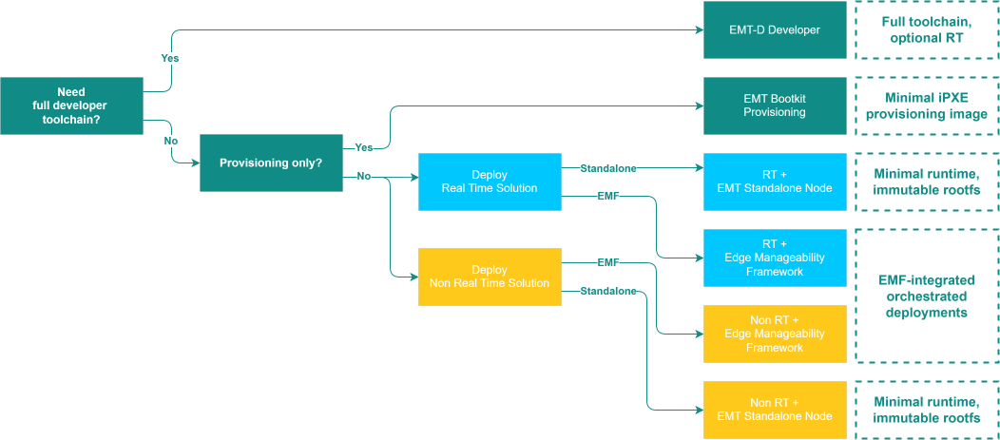

# Edge Microvisor Toolkit Versions

Edge Microvisor Toolkit is available in several pre-configured versions that
serve different purposes. Some are published as binaries, others are available
from a custom build. This document will help you select the version that best
suits your needs. To do so, check out:

## How to select the right EMT

The diagram
below will help you select the toolkit version right for your workflow.

## How EMT differs between versions

| Version | Real Time | Stable Kernel | [Next Kernel](../emt-architecture-overview.md#next-kernel) |
|--------|---------|-------------|------|
| [**Standalone (Immutable)**](https://github.com/open-edge-platform/edge-microvisor-toolkit-standalone-node) | Available for opt-in | ✓ | ✓ |
| [**Developer Node (Mutable)**](../emt-architecture-overview.md#developer-node-mutable-iso-image) | Optional | ✓ | ✓ |
| [**EMT for EMF**](../emt-deployment-edge-orchestrator.md) | Available for opt-in | ✓ | ✓ |
| [**Bootkit**](../emt-bootkit.md) | - | ✓ | – |

## How usage scenarios affect EMT setup

| Scenario | Description | Primary outcomes | Technology areas |
|---|---|---|---|
| Real-time & deterministic workloads | Run latency-sensitive workloads with guaranteed bounded jitter and repeatable execution timelines across one or more hosts, maintainable under steady-state and failure-recovery conditions |   - Bounded end-to-end latency & jitter   - Repeatable scheduling windows under load   - Cross-host timing consistency for distributed stages   - Fast, predictable recovery without violating SLOs |   - [PREEMPT_RT kernel](../emt-architecture-overview.md#preempt-rt-kernel)   - [Resource Director Technologies](../emt-architecture-overview.md#resource-director-technology)   - [Intel GPU RT](../emt-architecture-overview.md#intel-device-plugins-for-kubernetes)   - [CPU & Scheduler Isolation](../emt-architecture-overview.md#isolcpuslist)   - [Memory Determinism](../emt-architecture-overview.md#preempt-rt-kernel)   - Time & Clocks   - [Network Determinism (TSN)](../emt-architecture-overview.md#time-sensitive-networking-support) |
| VM-based workloads on Kubernetes with shared GPUs | Run multiple virtual machines on Kubernetes that concurrently share one or more physical GPUs, with predictable fairness, isolation, and policy-driven placement—using a KubeVirt stack extended for GPU sharing |   - Stable, repeatable GPU performance per VM under contention   - Hard/soft sharing policies (fair-share, priority tiers, or quotas)   - Safe isolation between tenants/VMs (memory, contexts, resets)   - Schedulable resources with clear admission signals (no surprise fails)   - Operational guardrails: health checks, graceful drain/eviction, rollback |   - [SRIOV](./deployment/emt-vm-host.md)   - [Intel GPU](../emt-system-requirements.md#discrete-gpu)   - [kubevirt](https://github.com/open-edge-platform/edge-microvisor-toolkit-standalone-node/blob/main/standalone-node/docs/user-guide/desktop-virtualization-image-guide.md)   - [Host virtualization](./deployment/emt-vm-host.md)   - [Intel GPU device plugin](../emt-architecture-overview.md#intel-device-plugins-for-kubernetes) |
| AI & Vision workloads | Enable AI inference and computer-vision workloads on edge nodes using Intel GPU and NPU acceleration, exposing unified hardware-assisted pipelines through standard APIs and user-space libraries |   - Efficient execution of deep-learning and vision inference on-device without cloud dependency   - Unified GPU/NPU compute abstraction for developers (OpenVINO backend, media pipelines)   - Deterministic frame-rate and latency for multi-stream analytics workloads (e.g., camera ingest)   - Seamless integration with containers or pods, including dynamic device discovery and sharing   - Stable ABI/API interface across [OS updates](../architecture/emt-updates.md) and driver versions |   - [Edge AI packages](https://eci.intel.com/docs/3.3/packages_list.html)   - [OpenVino](https://docs.openvino.ai)   - [Intel GPU and NPU drivers](https://docs.openvino.ai/2025/openvino-workflow/running-inference/inference-devices-and-modes.html)   - [Intel GPU device plugin](../emt-architecture-overview.md#intel-device-plugins-for-kubernetes) |

## How to build your own version of EMT.

You can create your own custom version of Edge Microvisor Toolkit by following
[the guide](./emt-building-howto.md). You can also try and learn how to
[build your own solution and deploy it on edge](./emt-build-and-deploy.md).
