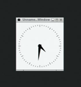

# Enable X11 Desktop UI in Edge Microvisor Toolkit Developer Node

## X11 Desktop UI Pre-Requisite

1. Connect through remote SSH, to the system that is pre-installed with the latest Edge Microvisor Toolkit ISO image.

2. If your system is behind a proxy server, export the proxy environment through the remote terminal. Replace <url_and_port_of_your_proxy_server> with the URL and port of your proxy server:

   ```bash
   export http_proxy="<url_and_port_of_your_proxy_server>"
   export https_proxy="<url_and_port_of_your_proxy_server>"
   ```
3. Install the required X11 packages through the tdnf package manager. Remove "-E" from the command if your system is not behind a proxy server:

   ```bash
   sudo -E tdnf install xorg-x11-server-Xorg xorg-x11-xinit xorg-x11-xinit-session xorg-x11-drv-libinput xorg-x11-apps xterm openbox libXfont2 freefont freetype gtk3
   ```
4. Install the nano text editor (optional). Remove "-E" from the command if your system is not behind a proxy server:

   ```bash
   sudo -E tdnf install nano
   ```
5. Install the PyXDG library through the Python package installer. Remove "-E" from the command if your system is not behind a proxy server:

   ```bash
   sudo -E python -m pip install PyXDG
   ```
6. Add a basic X11 configuration file for the Intel chipset (optional):

   ```bash
   cd /usr/share/X11/xorg.conf.d/
   sudo touch 20-modesetting.conf
   sudo nano 20-modesetting.conf
   ```
7. Add the following configuration into 20-modesetting.conf, and save:

   ```bash
   Section "Device"
     Identifier "Intel_Graphics"
       Driver "modesetting"
       Option "SWcursor" "true"
       Option "AccelMethod" "glamor"
       Option "DRI" "3"
   EndSection
   ```
## Launch X Server

### Manual Launch

1. In the remote terminal, export the XDG runtime dir and launch the Xorg server, with the OpenBox Desktop environment running in the background. Remove "-E" from the command if your system is not behind a proxy server:

   ```bash
   export XDG_RUNTIME_DIR=/tmp
   sudo -E bash -c 'xinit /usr/bin/openbox-session &'
   ```
### Auto Launch

For X Server to launch automatically during startup, you need to create a systemd service file as follows:

1. Create an openbox-session service file:

   ```bash
   sudo touch /lib/systemd/system/openbox-session.service
   ```
2. Add the following service content into the openbox-session.service file:

   ```bash
   [Unit]
   Description=Openbox Session
   After=multi-user.target graphical.target
   Wants=graphical.target

   [Service]
   ExecStart=/usr/bin/xinit /usr/bin/openbox-session
   Restart=on-failure

   [Install]
   WantedBy=multi-user.target
   ```
3. Enable the openbox-session service on startup, and restart the system:

   ```bash
   cd /etc/systemd/system/multi-user.target.wants
   sudo ln -sf /usr/lib/systemd/system/openbox-session.service .
   sudo systemctl daemon-reload
   sudo systemctl enable openbox-session.service
   sudo reboot
   ```
## Verify the X Server

1. In another remote terminal, launch the X11 client application to confirm the functionality:

   ```bash
   export DISPLAY=:0
   xhost +
   xclock
   ```
2. Verify the output where "xclock" is rendered onto the X11 Desktop as follows:

   

**Note:** If you want to disable the OpenBox Desktop UI from going into the sleep mode (blank screen), run the following command in a newly connected remote SSH terminal:

   ```bash
   export DISPLAY=:0
   xset s off
   xset -dpms
   ```
